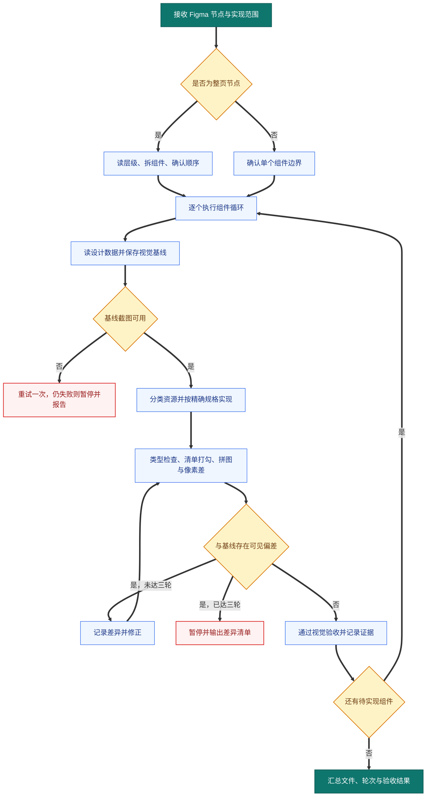

# /figma-impl — Figma 设计稿实现流程

## 适用范围

**只用于 `{SCOPE_ROOT}` 下的仓库。** 触发词「实现这个设计稿」很通用，在别的项目里也会
命中，那种情况不要走本流程，按该项目自己的技术栈和惯例做。

装在 `{SKILL_HOME}`，`~/.claude/skills/` 下建软链接指过去。软链接是必需的：工作区级
skill 只在 cwd 恰好等于该目录时加载，不从子目录继承，不建软链接就等于在实际写代码的
仓库子目录里永远不触发（见 harness `omc-skill-deploy`）。代价是全局可见，所以范围判断
的责任落在本节。

**设计依据**：历史数据显示 Figma 实现类任务的修复提交率超过 50%，根因是跳过截图与视觉比对
这两步。本流程用门禁把它们变成不可跳。

## 前置：Figma MCP 认证

`get_screenshot` / `get_metadata` / `get_design_context` 三个读取工具都要求对该文件有
**edit 权限**，view-only 一律拒，报错文案是 `you don't have edit access`。

- 先 `mcp__plugin_figma_figma__whoami` 确认身份。设计文件属于哪个账号，就得用哪个账号，
  跨账号打不开。
- 身份不对时：先在**默认浏览器**里退出当前 Figma 账号、登对的那个，**再**跑 `/mcp` 清认证
  重授权。只清认证不换浏览器登录态，会原样再授权一次同一个账号（实测踩过两轮）。
- **Dev seat 就够**，不需要 Full seat。

## 全流程



关键控制点：先确认粒度、存基线，再用截图闭环；任一门禁未过即暂停。

## 输入

| 参数 | 必填 | 说明 |
| --- | --- | --- |
| Figma 节点 ID 或链接 | 是 | 要实现的设计节点 |
| 目标文件路径 | 否 | 可以在第一步之后再定 |
| 实现范围 | 否 | 单组件 / 整页（默认单组件；整页强制拆分） |

## 整页拆分规则（强制）

给的是整页节点而不是单组件时，**先拆成组件清单**，再对每个组件单独跑完整循环。

```
整页节点
  → get_metadata 识别子组件边界
  → 拆成 N 个独立组件/区块
  → 列出实现顺序（自上而下、由外而内）
  → 用户确认拆分方案
  → 对每个组件跑下面的六步循环
```

**禁止**：整页一次性实现完再比对截图。

## 六步循环（每个组件跑一遍）

### Step 1 节点确认 ⛔ 门禁

调 `get_metadata({nodeId})` 看层级，确认拿到的是最外层容器（Modal 取遮罩层，Card 取最外框）。
用户给的是子节点就主动往上找父容器并告知。

门禁：粒度未确认不得继续。输出 `节点已确认：{nodeId} — {节点名}（{层级位置}）`。

### Step 2 取设计数据 ⛔ 门禁

```
get_design_context({
  nodeId, forceCode: true,
  clientLanguages: "typescript,css",
  clientFrameworks: "{CLIENT_FRAMEWORKS}",
  artifactType: "COMPONENT_WITHIN_A_WEB_PAGE_OR_APP_SCREEN"
})
```

门禁：必须传 `forceCode: true`。`clientFrameworks` 走装机时填的 `{CLIENT_FRAMEWORKS}`，
别照抄别的项目的值 —— 传错框架名，MCP 返回的代码风格就整个偏掉，而它不会报错。
`clientLanguages` 保持 `typescript,css` 不参数化：所有 web 栈都是这两样，没有可变的余地。
输出：保存返回的结构化代码，标出所有 localhost 资源 URL。

### Step 3 存视觉基线 ⛔ 硬阻塞门禁（最关键）

`get_screenshot({nodeId, maxDimension: 1400})` 拿到短时效 URL，`curl` 下载落盘。

**落盘位置走项目自己的归档约定，不要随手丢 `/tmp`**，见「项目专项」的 `{ARTIFACT_DIR}`。
文件名带节点号。

**同时落一份节点清单。** 把 Step 1 的 `get_metadata` 输出整理成一张表，每行一个
可见节点（名字、尺寸、在父容器里的位置），存成 `<组件>-inventory.md`。Step 6 要拿它
逐行打勾。

门禁：截图必须成功落盘；失败重试一次，仍失败就暂停并告知用户。

⛔ 这是硬阻塞：没有视觉基线就写代码等于盲写，不得继续。

### Step 4 资源与图标 ⛔ 门禁

扫出 Step 2 代码里全部 `http://localhost:3845/assets/` URL，逐个分类。

**品牌/定制图标**（Logo、专属图形）→ `curl` 下载到 `public/` 下合适的子目录，或抽成组件。

**判断不了的** → 列出每个图标的描述问用户属于哪一类。

#### 通用 UI 图标：先问「设计稿用的是哪个库」

`get_design_context` 的 Component descriptions 会直接给出库名和图标名，例如
`Lucide Icon / Search`、`Lucide Icon / ChevronDown`。**把它们逐个记下来，写进 Step 3 的
节点清单**，Step 6 要连图标一起打勾。

拿到库名后按顺序走：

1. **先查两件事：这个库是不是已经是项目依赖，以及「项目专项」有没有禁止直接用它。**
   `grep` package.json，再 `grep` 一下现有代码有没有人在用，然后回头看 `{ICON_SYSTEM}`
   那一栏列没列这个库。两条都满足（已是依赖、没被禁）就直接用设计稿画的那个库 —— 这是
   零成本的精确还原，比任何替换都好。
   **这里要分清两种项目规则，它们的强度不一样**：
   - 「项目统一用 X 图标库」这类**默认约定**，在**改版屏幕**上给设计稿让位。改版屏幕指
     这次设计稿覆盖到的那些屏幕，不含只是碰巧引用了同一个组件的其他屏幕。写清楚是
     「稿子画哪个库就用哪个库，其余屏幕不动」，并把这条记进方案。
   - `{ICON_SYSTEM}` 里明写的**禁止直接使用**（例如「lucide 只许出现在生成的原语内部」）
     是硬禁令，**不让位**，直接走第 2 条。
   判断不了某条到底是默认约定还是硬禁令，就停下来问用户，不要自己归类。
2. **库不在依赖里，或者被 `{ICON_SYSTEM}` 明确禁止直接使用**，才谈替换成项目现有的那套。
   替换必须**当场取证**：把设计稿的图标和项目图标裁到同一尺寸，**放大 8 倍上下拼起来看**。
3. **对不上就是对不上。** 不同图标库的同名图标是**不同的字形**，不是同一个图标的不同
   粗细 —— 放大镜的手柄长度和镜面比例、chevron 的张角、箭头的头身比，都会差。名字一样
   不构成理由。对不上时停下来问用户：装这个库，还是接受偏差。**不要默默用形似的顶上。**

还要一起对的两件事：

- **尺寸**：设计稿给的是 12 / 16 / 24 这种确定值，照抄。注意有些图标组件的外框不是正方形
  （例如 `1em × 1.25em`），会把视觉尺寸带偏，必要时显式写死宽高。
- **粗细**：设计稿常用 lucide（stroke 1.5）。换库时挑权重相近的那一档，细一档在 1 倍下
  看不出来、放大就露馅。

门禁：输出一张图标清单，每行是「设计稿图标名 → 实现用的图标 → 同源 / 已取证替换 /
待用户决定」。有「待用户决定」就停下来问，不要往下走。

### Step 5 写代码

1. **精确数值照抄，不要换成 Tailwind 语义类**：`gap-[32px]` 就写 `gap-[32px]` 不写 `gap-8`；
   `p-[40px]` 不写 `p-10`；`rounded-bl-[16px]` 不写 `rounded-l-2xl`。唯一例外是项目里
   确实存在完全匹配的 design token。
2. **颜色**：有 `var(--xxx)` 就用对应 token；裸 hex/rgba（Figma 硬编码）写原值并加
   `@figma-hardcoded` 注释；不要自己造新 token。
   **不许凭语义猜。** 「这是次要文字，那就 `--muted-foreground` 吧」是最常见的错源。
   每个颜色都要有出处：Step 2 的注释、资源 SVG 里的 `fill`/`stroke`，或者直接从基线
   图上采样那几个像素。三者对不上时以采样为准，并在注释里写明。
3. **缺数据不等于不实现。** 设计稿上画了、而代码里「没有这个字段」时，按顺序往下走，
   **不要直接删掉这个元素**：
   1. 先查数据是不是真的没有。查到接口的 DTO 就停是不够的，要一路查到数据库列和写
      入路径 —— 字段常常已经存在，只是没有被投影出来。
   2. 确实没有，就用**设计稿自己的内容硬编码**（它的占位文案、它导出的那张图），并
      在注释里写清楚这是占位、等哪个批次接真数据。
   3. 只有当硬编码会造成误导（编造出用户会当真的数字、姓名、金额）时，才留空，
      并且必须当场问用户，不能自己记一条 gap 就算完。
   删掉一个设计稿上有的元素是范围决策，不是技术约束，轮不到实现者单方面做。
4. **没画的也不要加。** 上一条的反面，同等重要：设计稿上没有的元素、状态、分支、
   空态、hover 文案，一律不实现。常见的自作主张是「把设计稿画的一个状态推广成一套」
   —— 稿子上画了 Draft 徽章，就只做 Draft，不要顺手补出 Active 和 Archived 三件套。
   稿子缺哪个状态，是问设计的事，不是补全的事。
   一句话：**画了的不许删，没画的不许加。** 两个方向都是范围，都不归实现者定。
5. **效果属性**（opacity / blur / shadow / gradient）：先 grep 项目里同类效果的现有实现，
   以项目参数为基线适配，不要直接照搬 Figma 数值。
6. 单次改动不超过 3 个文件。

### Step 6 视觉验收 ⛔ 交付门禁

三件事都要做，**缺一件就不算过**。量出来的数字对，不代表画面对：数字只能覆盖你想到
要量的东西，对「本来该有、但你没实现」的元素完全是瞎的。

**6.1 清单打勾（防漏）**

拿 Step 3 那份节点清单，一行一行对着实现打勾。每个可见节点必须有三种下场之一：
已实现 / 按 Step 5 第 3 条硬编码了占位 / 用户明确说了不做。**没有第四种。**
输出这张打完勾的表。

**6.2 并排放大比对（防偏）**

1. 起开发服务器，在浏览器里打开实现。
2. 截实现图，裁到和基线同一个区域。
3. **把两张图上下拼成一张、放大到 2 倍以上再看。** 1 倍全页截图看不出字重、图标
   粗细、颜色深浅这一类偏差 —— 这几样恰好是最常出问题的。
4. 逐项过：布局结构、间距、颜色、圆角、字号字重、图标、效果。

**6.3 像素差（防自我感觉良好）**

对齐后算差异比例，**并按区域拆开报**：哪一块贡献了多少。整体一个数字会把一处大偏差
匀掉 —— 一处 65% 的区块偏差，摊到整页就只剩 7%，看上去像通过了。文字和图标边缘的抗锯齿
差异是正常的，结构性偏差不是。

`{DIFF_COMMAND}` 无论是自带工具还是兜底脚本，都要给出同一组东西：**一个整体比例，
外加逐区块的比例**。只报一个整体数字不算做过这一步。

项目专项那栏填的是 `无` 时（这是约定的哨兵值，不是一条要执行的命令），用下面这段兜底，
只依赖 Pillow：

```bash
python3 - "<基线图路径>" "<实现图路径>" <<'EOF'
import sys
from PIL import Image, ImageChops
a = Image.open(sys.argv[1]).convert("RGB")
b = Image.open(sys.argv[2]).convert("RGB")
if a.size != b.size:
    print(f"尺寸不同：基线 {a.size} 实现 {b.size}，先裁到同一区域再比，不要缩放")
    sys.exit(1)
d = ImageChops.difference(a, b).split()
m = ImageChops.lighter(ImageChops.lighter(d[0], d[1]), d[2])
THRESHOLD, ROWS, COLS = 16, 3, 3   # 阈值 16 当抗锯齿噪声；低对比度偏差调到 8
mask = m.point(lambda v: 255 if v > THRESHOLD else 0)   # 宽扁组件可以改成 3 行 5 列
w, h = a.size
def ratio(box=None):
    x = mask.crop(box) if box else mask
    n = x.size[0] * x.size[1]
    return x.histogram()[255] / n if n else None
def fmt(v):
    return "区域太小，无法统计" if v is None else f"{v:.2%}"
print(f"整体差异 {fmt(ratio())}")
for i in range(ROWS):
    for j in range(COLS):
        box = (j*w//COLS, i*h//ROWS, (j+1)*w//COLS, (i+1)*h//ROWS)
        print(f"  区块[{i}][{j}] {fmt(ratio(box))}")
EOF
```

连 Pillow 都装不了时，这一步仍然既不许跳过、也不许含糊过去：在验收输出里**明写一行**
「本环境无差异工具，本组件仅凭 6.1 与 6.2 通过」。缺口要留在纸面上，不能靠沉默带过。

有偏差就改、重截、再比；**每个组件最多三轮**，三轮仍不 match 就暂停并输出差异清单。

门禁：6.1 的表全绿，6.2 的拼图无可见偏差，6.3 的差异数字（或那行明写的缺口声明）在场。
**三件事缺一件就不算过** —— 这条和本节开头那句是同一条，不要只照着门禁行做两件。
证据这样给：拼图和清单给文件路径，6.3 直接把整体比例和分区比例贴在验收输出里。

## 项目专项（装机时填）

这一节是模板，按项目替换。没有这一节的技能等于没装好：下面每一条都是「写错了不会报错、
只会安静地产出错东西」的那种坑。

**技术栈**：`{STACK}`。Figma MCP 返回的永远是 React + Tailwind，必须翻译过去。

**图标**：`{ICON_SYSTEM}`。这一栏**只登记两个事实**：项目默认用哪套图标，以及哪些库
**禁止直接使用**（即使它已经在依赖里）。**选哪个库的决定过程在 Step 4，不在这里** —— 默认
那套会在改版屏幕上给设计稿让位，只有明写的禁令不让位。这一栏写成「产出一律用项目自己的
那套」会和 Step 4 第 1 条打架，装机时不要那么填。
找不到对应图标立刻告知用户并等指示，不要随手换一个形似的；尺寸和粗细的对法见 Step 4。

**颜色与 token**：`{COLOR_SYSTEM}`。实现前先查项目的映射表（哪个组件的哪一部分该用哪个变量），
不要自己造新 token。

**命令**：

```bash
{DEV_COMMAND}        # 起开发服务器
{TYPECHECK_COMMAND}  # 类型检查
{TOKEN_CHECK}        # 校验设计 token 没漂（如果有）
```

**截图验收怎么起**：`{SCREENSHOT_SETUP}`。至少写清楚三件事：用什么浏览器（headless 与
headed 的渲染差异是真实存在的，滚动条几何、字体抗锯齿都会变）、登录态怎么造、截图落到哪。

**差异工具**：`{DIFF_COMMAND}`。Step 6.3 用它出差异比例。项目没有专门工具就写「无」，
Step 6.3 里有一段只依赖 Pillow 的兜底脚本可以直接用。

**落盘位置**：`{ARTIFACT_DIR}`。基线图、实现图、拼图、节点清单都放这里，不要丢 `/tmp`。

## 可选开关

| 开关 | 说明 |
| --- | --- |
| `--pc-only` | 只做桌面端（≥768px） |
| `--h5-only` | 只做移动端（<768px） |
| `--skip-effects` | 跳过 shadow/blur/gradient，后续单独处理 |
| `--dry-run` | 只跑 Step 1–4（分析 + 资源），不写代码 |

## 报错速查

| 现象 | 处理 |
| --- | --- |
| `you don't have edit access` | 见「前置：Figma MCP 认证」，八成是账号没换过来 |
| `get_design_context` 输出被截断 | 确认传了 `forceCode: true`；仍截断就拆子节点分段取 |
| `get_screenshot` 失败 | 重试一次，仍失败请用户手动给图 |
| 节点 ID 无效 | 请用户确认，或用 `get_metadata` 帮忙定位 |
| 实现与设计差太多 | 三轮仍不 match → 暂停，输出差异清单，等指示 |
| 效果属性在真实环境对不上 | 优先用项目里同类效果的现有参数，并写明适配理由 |
| 设计稿的图标库不在依赖里 | 走 Step 4 第 2 条的替换阶梯，8 倍取证；对不上就停下来问，不要形似顶上 |
| 设计稿的库已是依赖，但项目专项禁止直接用 | 那是硬禁令，不让位，同样走第 2 条替换并取证 |
| 项目没有差异工具 | 见 Step 6.3：在验收输出里明写这个缺口，不要把 6.3 当作不存在 |

## 反模式（历史教训）

| 反模式 | 后果 | 本流程怎么拦 |
| --- | --- | --- |
| 没截图就开写 | swap-figma 项目 10 个修复提交 | Step 3 硬阻塞 |
| 整页写完才比对 | 差异累积无法定位 | 整页强制拆成逐组件循环 |
| 用近似的 Tailwind 语义类 | 间距/圆角全局偏移 | Step 5 照抄规则 |
| 忽略 localhost 资源 URL | 组件缺图标缺图 | Step 4 强制资源清单 |
| 直接照搬 Figma 的效果参数 | 毛玻璃/阴影在真实环境看不见 | Step 5 环境适配流程 |
| 给品牌图标用通用图标库 | 用户反复纠正 | Step 4 分类规则 + 不确定就问 |
| 按名字认为两个库的同名图标是同一个 | 字形不同，不是粗细不同，验收时一眼看出来 | Step 4 第 3 条：替换必须 8 倍取证 |
| 拿项目默认图标约定盖掉稿子已在依赖里的库 | 白白制造偏差，而精确还原本来是免费的 | Step 4 第 1 条：先查依赖，并区分默认约定与硬禁令 |
| 在 headless 里量滚动条 | 某些机器上是 0 宽 overlay，量出来永远「没问题」 | 项目专项的 headed 浏览器要求 |
| 用「量到的数字都对」代替看图 | 数字只覆盖你想到要量的，漏掉的元素永远量不出来 | Step 6.1 清单 + 6.2 并排图 |
| 只在 1 倍全页截图上验收 | 字重、图标粗细、颜色深浅全看不出来 | Step 6.2 强制 2 倍以上拼图 |
| 「后端没这个字段」就删掉设计稿上的元素 | 范围被实现者单方面缩了，而且字段往往其实存在 | Step 5 第 3 条的三级阶梯 |
| 查到 DTO 没这个字段就下结论 | 字段常常已经在库里、只是没投影出来 | Step 5 第 3 条要求查到数据库列 |
| 按语义猜颜色 token | `--muted-foreground` 和 `--foreground` 差一档，肉眼看得出来 | Step 5 第 2 条要求采样取证 |
| 把稿子上的一个状态"补全"成一套 | 交付里多出没人要过的 UI，验收时被打回 | Step 5 第 4 条：没画的不许加 |
| 只报一个整体差异数字 | 一处大偏差被其余区域匀掉，看不出是哪块坏了 | Step 6.3 要求按区域拆开报 |
| 项目没差异工具就默默跳过 6.3 | 验收少一条腿，而且看交付的人不知道少了 | Step 6.3 要求明写缺口声明 |
