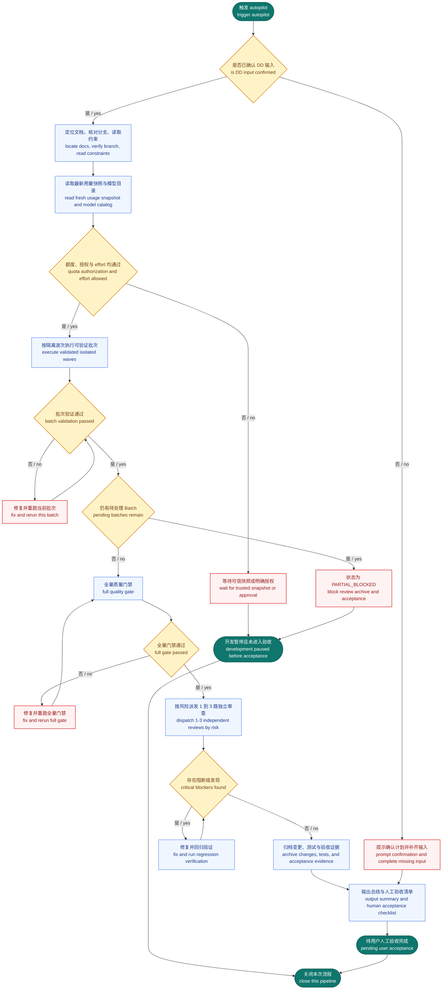

# /autopilot — Fully Automated Development Pipeline

> **Multi-project universal version.** `{placeholders}` are project-specific customization points. Before migrating to a new project, replace all placeholders with actual values per `SETUP.md`.
> feat produces the plan → autopilot delivers it: **batch development (with appropriate tests per batch) → 1–3 parallel review agents as needed → main flow auto-handles findings → docs archived + acceptance notification**.

Simulates a real engineering team: product confirms PRD → engineers implement in batches with self-testing → 1–3 senior engineers review in parallel → engineer addresses findings → delivery docs assembled → human acceptance.

---

## Core Principles

1. **Only start after a plan is confirmed** — this skill does not design plans; it executes already-confirmed plans (DD/ENH/BUG)
2. **额度授权外不暂停 / No pauses outside quota authorization**，Terra 准入后自动执行。Luna、Spark 和 Luna 的 `high` 至 `xhigh` 提升必须遵守本次运行授权门禁
3. **Appropriate tests per batch** — each batch runs tests relevant to that batch (co-located unit tests + type checks), not just type checks alone; full gate runs after all batches complete
4. **Reviews use real subagents, 1–3 in parallel as needed** — not the main conversation switching to "review mode" for self-review (code-writing context cannot self-approve); scale is determined by change size and risk
5. **Main flow auto-handles review findings** — Critical/Major items are fixed automatically; Minor/low-ROI items are automatically deferred to a backlog
6. **Process and acceptance docs archived in requirement subfolder** — all artifacts go to `{DOCS_ROOT}/{type}/{ID}/` (see §Doc Archiving Convention)
7. **Notify user for acceptance on completion** — output an acceptance checklist and surface it explicitly to the user in the conversation
8. **Never auto-push/merge to remote** — stops at local main branch squash commit; user decides on pushing
9. **Strictly follow project conventions** — project `{RULES_DIR}` / conventions (Batch ≤N files, lessons-first, worktree default, tiered review fixes) all apply
10. **开发模型由额度门禁决定 / Quota selects the development model**，Terra 是默认开发模型。Luna 和 Spark 只能在本次运行获得明确授权后使用，不得因模型缺失、额度未知或路由错误静默替换
11. **推理档位与并行度独立决策 / Decide effort and concurrency independently**，推理档位由 DD 工程证据决定，并行度由依赖、文件所有权、worktree、Git 分支和运行时资源隔离决定

## 自动化主流程总览 / Automated pipeline summary



图说明：本图说明 autopilot 从确认输入到验收关闭的连续门禁与审查链路。This flow shows autopilot's chained gates, review loop, and acceptance handoff after input confirmation.

---

## Doc Archiving Convention (Mandatory)

All autopilot artifacts go into the **requirement subfolder** `{DOCS_ROOT}/{type}/{ID}/`. Flat placement is prohibited.

```
{DOCS_ROOT}/{designs|enh|bug|...}/{ID}/
├── INDEX.md                  Directory index (artifact list + phase timeline + key commits)
├── {DD|ENH|BUG}.md           Plan document (exists before autopilot starts)
├── reviews/                  Review reports (plan-review from feat / code-review from this skill)
│   ├── REV-plan-v1-A-{agent}.md   (feat phase plan review)
│   ├── REV-code-v1-A-{agent}.md   (autopilot code review)
│   └── REV-code-v1-B-{agent}.md   (v2 = second review pass, does not overwrite v1)
├── CHANGES.md                Phase 4: commit list + added/modified/deleted files
├── TEST_PLAN.md              Phase 4: AI-automated test items (type/unit/full/build/review)
├── ACCEPTANCE.md             Phase 4: mandatory human acceptance items (browser/integration/edge cases)
└── enh-todo-additions.md     Phase 3: deferred Class-B items
```

> Multi-platform tasks (e.g., PC + mobile) may split into `TEST_PLAN-{platform}.md` / `ACCEPTANCE-{platform}.md`.
> Previously flat-organized legacy requirements remain as-is; all new tasks must use the subfolder structure.
> ⚠️ If `{DOCS_ROOT}` is gitignored, worktree cleanup must `cp` the subfolder back to the main workspace (see §Cleanup).
> Reference example: `{EXAMPLE_REQUIREMENT_FOLDER}`.

---

## Phase 0: Startup Checks

### 0.1 Locate Plan Document + Requirement Subfolder

```
Resolution order:
1. {ID} path explicitly mentioned in the conversation
2. Infer from current branch name (feat/xxx → designs/{ID}/, fix/xxx → bug/{ID}/)
3. Most recently modified plan file
```

**Handoff priority**: If handed off from feat (the conversation already contains a confirmed DD path from a gate announcement) → **reuse that path directly**, skip the three-level inference below; the inference is only for standalone `/autopilot` entry points.

Lock the requirement subfolder `{DOCS_ROOT}/{type}/{ID}/`. Read the plan document and extract: implementation plan (Batch/Phase list), component breakdown (which files change), key technical decisions.

**No implementation plan → BLOCK**: The plan must contain an executable implementation plan; otherwise prompt the user to add one.

### 0.2 Branch Check

| Current Branch | Behavior |
|----------------|----------|
| Main branch (main/master) | **BLOCK** — prompt to create a feature branch or use worktree |
| `feat/*` / `fix/*` / `refactor/*` / `chore/*` | Pass — record branch name + worktree absolute path |

### 0.3 Lessons Learned Lookup (if project has `{LESSONS}`)

Read `{LESSONS}`, match relevant sections to the plan's technical domain, surface key pitfall reminders. **Continue without waiting for confirmation.**

### 0.4 Workspace State + Task Type

Run `git status --porcelain` to check for uncommitted changes. Identify task type: contains design node IDs / "design/pixel-perfect" keywords / JSX rendering → **UI task** (Phase 1 adds design-driven implementation + visual acceptance, see `{DESIGN_IMPL_SKILL}`); otherwise standard task.

### 0.5 开发 worker 路由预检 / Development worker routing preflight

Phase 1 开始前和每个开发波次开始前，必须重新取得同一额度周期的最新可信用量快照。优先使用运行时未来提供的官方机器可读数据，否则只接受用户在本次运行提供的 `/usage` 快照。插件不得读取浏览器会话、Cookie 或非公开账户接口。

Before Phase 1 and before every development wave, obtain a fresh trusted usage snapshot for the same quota period. Prefer an official machine-readable runtime source when available. Otherwise accept only a `/usage` snapshot supplied by the user during this run. The plugin must not inspect browser sessions, cookies, or private account endpoints.

用量输入至少包含以下字段 / Required usage fields:

```text
usage.period_id
usage.captured_at
usage.weekly_remaining_percent
usage.today_used_percent
runtime.current_period_id
runtime.now
runtime.snapshot_max_age_seconds
```

纯函数测试可显式注入 `runtime`。生产 CLI 不信任路由 JSON 内的同名字段，它使用系统 UTC 时间作为 `runtime.now`，把刚读取的当前额度周期通过独立参数注入 `runtime.current_period_id`，并固定快照有效期为 900 秒。快照缺失、周期不匹配、过期或百分比无效时，停止在预检阶段。运行记录只保存额度周期、快照时间、两个百分比、选择结果和授权文本，不保存完整 `/usage` 输出。

Pure function tests may inject `runtime` explicitly. The production CLI distrusts those fields in route JSON. It generates `runtime.now` from the system UTC clock, injects the just-read current quota period through a separate argument, and fixes snapshot validity at 900 seconds. Stop in preflight for a missing, mismatched, stale, or invalid snapshot. Store only the period, snapshot time, two percentages, route result, and authorization text. Do not persist the complete `/usage` output.

每次启动同时读取实时模型目录，按 `terra`、`luna`、`spark` 能力层记录具体模型 ID、可用状态和支持的 reasoning effort。Spark 未出现在目录中时不得展示为可执行选项。模型缺失或不支持 DD 指定档位时停止，不得静默替换或降低 effort。

Read the live model catalog at startup and record the concrete model ID, availability, and supported reasoning efforts for the `terra`, `luna`, and `spark` capability tiers. Do not present Spark as executable when it is absent. Stop when a model is unavailable or does not support the DD effort. Never substitute a model or lower effort silently.

额度计算 / Quota calculation:

```text
daily_headroom = 25% - today_used_percent
wave_reserve = worker_count × 5%
```

准入规则 / Admission rules:

1. 周剩余大于或等于 25%，且 `daily_headroom >= wave_reserve`，选择 Terra，无需额外授权。
2. 周剩余大于或等于 10% 且小于 25%，或 Terra 的日额度预留不足，选择 Luna，等待本次运行和明确 Batch 集合的用户授权。
3. 周剩余小于 10%，先确认实时目录存在 Spark，再等待本次运行和明确 Batch 集合的用户授权。只有 `spark_eligible: true` 的 Batch 可以进入 Spark 决策。
4. 每个后续波次必须刷新快照，旧快照不得复用。
5. At 25% or more weekly remaining with enough daily reserve, use Terra without extra approval.
6. From 10% through 24%, or when Terra daily reserve is insufficient, require run-scoped Luna approval for the listed Batches.
7. Below 10%, first confirm Spark in the live catalog, then require run-scoped approval. Only `spark_eligible: true` Batches may proceed.
8. Refresh the snapshot before every later wave. Never reuse an older snapshot.

路由必须通过 `scripts/autopilot_quota_router.py`。`decide_batch_route()` 是无副作用纯函数，输出状态只允许 `ALLOW`、`AWAITING_APPROVAL` 或 `PARTIAL_BLOCKED`。唯一 worker 调度入口是 `dispatch_wave()`，它只把 `ALLOW` 决策交给注入的启动器。

Routing must use `scripts/autopilot_quota_router.py`. `decide_batch_route()` is a side-effect-free function whose only statuses are `ALLOW`, `AWAITING_APPROVAL`, and `PARTIAL_BLOCKED`. `dispatch_wave()` is the sole worker dispatch entry and passes only `ALLOW` decisions to the injected launcher.

主流程把最小路由输入写入受限临时 JSON，并执行 / The main flow writes the minimal route input to a restricted temporary JSON file and runs:

```bash
PYTHONDONTWRITEBYTECODE=1 python3 scripts/autopilot_quota_router.py --input {ROUTE_REQUEST_FILE} --current-period-id {CURRENT_PERIOD_ID}
```

退出码为 0 时，主流程只能把输出 `launch_results` 中的 Batch、模型、effort、worktree、分支、文件所有权和运行时资源逐项交给 Codex 原生 Agent 工具。顶层 `ALLOW` 表示整波可执行。顶层 `PARTIAL_BLOCKED` 且清单非空时，只执行清单中的合格 Batch，运行保持部分阻塞，禁止进入完整门禁、Review、归档或验收。退出码非零、清单为空或字段不匹配时，原生 Agent 调用次数必须为零。CLI 会解析真实 Git 根目录、common directory 和当前分支，要求同一波次的 linked worktree 属于同一协调仓库，消解符号链接与 macOS 路径别名，并把文件所有权规范成仓库相对路径。

On exit code 0, the main flow may pass only entries in `launch_results` to the Codex native Agent tool. Top-level `ALLOW` means the whole wave is executable. Top-level `PARTIAL_BLOCKED` with a non-empty manifest executes only eligible Batches while blocking the full gate, Review, archive, and acceptance. A nonzero exit, empty manifest, or field mismatch must produce zero native Agent calls. The CLI verifies the real Git root, common directory, and current branch, requires all linked worktrees in a wave to belong to one coordinating repository, resolves symbolic links and macOS path aliases, and normalizes file ownership to repository-relative paths. Codex currently exposes no public native Agent API callable from local Python, so this script emits an executable manifest rather than pretending to invoke that tool directly.

DD 的 `reasoning_effort` 只允许 `high`、`xhigh` 或 `max`。Terra 保持 DD 档位。Luna 只允许 `xhigh` 或 `max`，当 DD 写入 `high` 时，必须在同一授权中明确批准该 Batch 的 `high` 至 `xhigh` 提升。Spark 不预设档位，只接受实时目录明确支持的 DD 原始档位，不得自动提升。

The DD may specify only `high`, `xhigh`, or `max`. Terra preserves that effort. Luna accepts only `xhigh` or `max`; a DD value of `high` requires explicit approval for that Batch to raise it to `xhigh`. Spark uses only the original DD effort supported by the live catalog and never raises effort automatically.

每次 Codex 原生开发 worker 委派都必须显式写出 / Every Codex native development worker call must declare:

```text
agent_type = "default"
model = 判定器返回的 selected_model
reasoning_effort = 判定器返回的 reasoning_effort
```

### 0.6 批次依赖与并行波次 / Batch dependencies and parallel waves

主流程调用 `plan_execution_waves()`，按 DD 中的依赖、文件所有权和共享运行时资源构建波次。默认并行上限为 3。只有前置依赖已在更早波次完成、文件所有权和运行时资源不相交，并且使用独立 worktree 和独立 Git 分支的 Batch 才能并行。

The main flow calls `plan_execution_waves()` to build waves from DD dependencies, file ownership, and runtime resources. The default parallel limit is 3. Batches may run together only when all dependencies completed in earlier waves, file ownership and runtime resources do not overlap, and each Batch has an independent worktree and Git branch.

不满足并行条件时必须拆成串行波次。每个 worker 只在自己的 worktree 完成代码、测试和单个 Batch 提交。主流程把已验证分支串行集成到协调分支，并在每次集成后运行相关测试。

Split non-isolated work into serial waves. Each worker completes code, tests, and one Batch commit only in its own worktree. The main flow integrates verified branches serially into the coordination branch and runs relevant tests after each integration.

### 0.7 Startup Announcement

首个开发 worker 启动前，必须说明以下内容 / Before the first worker starts, announce:

```text
🚀 Autopilot 执行预检
计划：{DD 绝对路径}
范围：{本次范围摘要}
用量：{周期、快照时间、周剩余、当天已用、daily_headroom、wave_reserve}
模型准入：{模型、授权状态或停止原因}
执行波次：{每个首波 Batch 的模型、effort、effort_basis、文件所有权、worktree 和分支}
开发 worker：{数量和满足的并行条件}
后续顺序：开发与批次测试，完整质量门禁，独立只读 Review，Class A 修复及复审，归档与验收通知
```

需要 Luna、Spark 或 `high` 至 `xhigh` 提升授权时，说明必须明确写出本次运行 ID、额度周期、Batch 集合、授权有效期和授权文本。未获得授权前，不启动开发 worker，也不修改业务代码。

When Luna, Spark, or a `high` to `xhigh` raise needs approval, state the run ID, quota period, Batch set, authorization expiry, and authorization text. Do not start a worker or modify business code before approval.

---

## Phase 1: Batch Development

### 1.1 Batch Breakdown

Extract batches from the implementation plan. Each batch: **≤ {MAX_FILES_PER_BATCH} files**, logically complete minimal unit (can independently pass type checks), strict ordering for dependencies. Auto-subdivide if granularity is too coarse. 每个 Batch 必须带有 DD effort 字段、依赖、文件所有权、worktree、分支和运行时资源集合，再由 §0.6 生成波次。

### 1.2 配额感知 worker 契约 / Quota-aware worker contract

主流程只能消费 §0.5 CLI 内部 `dispatch_wave()` 返回的 `launch_results` 启动 worker。不得绕过判定器直接调用 Agent，不得把 `AWAITING_APPROVAL` 决策或 `PARTIAL_BLOCKED` 决策交给启动器。混合 Spark 波次可执行清单中的 `ALLOW` Batch，但顶层运行状态保持 `PARTIAL_BLOCKED`。Terra 无需额外批准，Luna 和 Spark 的授权只对本次运行、额度周期、授权 Batch 集合和有效期生效。

The main flow may start workers only from `launch_results` returned by the §0.5 CLI and its internal `dispatch_wave()` call. It must not call an Agent around the router or send an `AWAITING_APPROVAL` or `PARTIAL_BLOCKED` decision to a launcher. A mixed Spark wave may execute its listed `ALLOW` Batches while the top-level run remains `PARTIAL_BLOCKED`. Terra requires no extra approval. Luna and Spark approval applies only to the current run, quota period, listed Batches, and validity window.

每个 worker 提示必须包含 worktree 绝对路径、分支、DD 绝对路径、本 Batch 范围、文件所有权、验证命令和返回字段。波次结束后必须取得新用量快照，未刷新时不得启动下一波。

Each worker prompt must include the absolute worktree path, branch, absolute DD path, Batch scope, file ownership, verification commands, and required result fields. Obtain a new usage snapshot after the wave. Do not start the next wave without it.

### 1.3 Single Batch Execution

**Step 1 — Code**: Implement per plan design at the **test seam the DD §6 picked** (reuse the highest existing seam; don't invent new ones mid-batch), follow project code conventions, apply lessons learned to avoid known pitfalls. For batches that touch real behavior, prefer a test-driven discipline (RED→GREEN→refactor, one tracer-bullet slice at a time; see the `tdd` skill) over write-code-then-test.
**Step 1.5 — Design-driven (UI tasks only)**: Use `{DESIGN_IMPL_SKILL}` workflow to fetch design data → code to exact values → per-component visual acceptance; subagent delegates must include design node IDs.

**Step 2 — Appropriate test verification (required per batch)** — not just type checks; run tests matching this batch's change nature:

```bash
{TYPECHECK}                          # always run
{TEST} {test files/dirs for this batch}   # run co-located unit tests for changed code
```

| Batch change type | What to run |
|-------------------|-------------|
| Pure functions / utility libraries | Corresponding co-located unit tests (P0 required) |
| Global state / store | Corresponding store tests |
| Hook logic | Corresponding hook tests (hook changes should include tests) |
| Component rendering/interaction | Component tests in the component directory |
| Type contracts / API layer | Affected integration tests |
| Pure styling / copy | Skip unit tests, mark `visual-fix`/`copy-fix`, type check only |

No corresponding tests but changed core logic → write a failing test (red) first then fix (green) per the `tdd` skill (assert **external behavior**, not implementation), or explicitly mark "pre-existing gap, log to enh-todo". Type/test failures → **fix immediately**, do not proceed to the next batch.

**Step 3 — Commit**: `git commit`, message follows project language conventions, no AI attribution.
**Step 4 — Batch announcement**: List changed files + verification results + commit.

### 1.4 After All Batches Complete (Full Gate)

```bash
{TYPECHECK} && {LINT} && {TEST} && {BUILD}
```

- If new files were created that are indexed by `{GEN_ASSETS}` → run `{GEN_ASSETS}` first to refresh (otherwise pre-commit hook will block)
- Any failure → fix the root cause; `--no-verify`/`SKIP_*` bypasses are prohibited; fixes are **appended as independent commits** (not amending batch history), to be squashed together later
- If files were deleted → grep to confirm no leftover imports + index is synced
- 任一 Batch 保持待处理时，本次运行状态必须为 `PARTIAL_BLOCKED`。不得进入完整质量门禁、Phase 2 Review、归档或验收通知。若要把已完成 Spark Batch 独立交付，必须生成缩小范围的 DD 并取得新的用户确认
- If any Batch remains pending, the run status is `PARTIAL_BLOCKED`. Do not enter the full quality gate, Phase 2 Review, archiving, or acceptance notification. A separate delivery for completed Spark work requires a reduced-scope DD and new user confirmation

---

## Phase 2: 1–3 Parallel Review Agents As Needed

**Core: use real subagents for review — not the main conversation switching to "review mode" for self-review** (code-writing context cannot self-approve). Review agents are independent subagents running in parallel, each producing their own REV report.

### 2.1 Determine Agent Count As Needed (1–3, size/risk-driven)

| Agent count | When | Composition |
|-------------|------|-------------|
| **1** | Small change (≤~5 files, low risk, mechanical changes like contract migration/copy/config) | `code-reviewer` |
| **2** (default) | Standard feature / multi-file / has business logic | `code-reviewer` (deep review) + `{QUALITY_SCANNER}` (high-frequency pitfall quick scan; if unavailable, use `test-engineer` or a generic reviewer as the second agent) |
| **3** | Large / security-sensitive / funds·auth·payments / cross-module | Above + domain third: `security-reviewer` or `test-engineer` or `performance-engineer` |

When in doubt, use 2.

### 2.2 Parallel Delegation (Agent tool, multiple Agent calls in one message)

Each review agent prompt **must explicitly inject** (subagents do not inherit main conversation context):

1. **Working directory** (worktree absolute path) + commit range under review
2. **Task background**: plan document path + requirement summary
3. **Required context**: project key conventions (`{PROJECT_CONVENTIONS}`: e.g., runtime output language, precision arithmetic, design tokens, testing standards); UI tasks additionally include design node IDs
4. **Review focus**: listed by change domain, highest-risk items first
5. **Output destination**: complete REV report written to subfolder absolute path `{DOCS_ROOT}/{type}/{ID}/reviews/REV-code-v1-{A|B|C}-{agent}.md`, following project review standards (🚨Critical/⚠️Major/ℹ️Minor + per-issue `[severity/trigger scenario/impact scope/fix ROI]` 4-column format + test coverage review section + Deletion Test section)
6. **Final message only reports**: N Crit/M Major/K Minor + overall verdict + report absolute path (**do not paste full text** — prevents context truncation/output hook from swallowing the report; if the report is swallowed, retrieve it from the subagent's persisted transcript per `{SUBAGENT_TRANSCRIPT}` by extracting the longest assistant text block)

> Multi-agent reviews **must each produce a separate file** (REV-code-v1-A/-B/-C); merging them is prohibited.
> **Version convention**: first pass is `v1`; if code is modified and a second review pass is needed (triggered by human instruction), create a new `v2` file — do not overwrite v1.

### 2.3 Aggregate Findings

After all reports are collected, the main flow reads each REV, deduplicates findings, and produces a combined verdict: 🟢 Ship It / 🟡 Needs Changes / 🔴 Major Rework + Crit/Major/Minor counts.

---

## Phase 3: Main Flow Auto-Handles Review Findings (Tiered Fix)

### 3.1 Triage

| Class | Covers | Action |
|-------|--------|--------|
| **Class A (fix immediately)** | Critical, Major Bug, blocking logic, severe performance, architecture violation, missing tests (core logic with no corresponding tests) | Fix code immediately |
| **Class B (defer)** | Minor, refactor suggestions, low ROI, high-risk non-urgent items, pre-existing gaps | Move to subfolder `enh-todo-additions.md` |

> **Downgrade judgment**: A Major item that is pre-existing, behavior-preserving, and low-risk may be downgraded to Class B and logged — but this must be explicitly stated in the REV writeback + final report with **a clear rationale for the downgrade**.

### 3.2 Class A Fixes

- Class A 修复是新波次，必须重新取得用量快照，并通过 §0.5 的唯一判定器和本次授权范围。不得根据缺陷复杂度直接指定 Terra、Luna 或 Spark
- Treat every Class A fix as a new wave. Refresh the usage snapshot and pass the sole §0.5 router plus current authorization scope. Defect complexity must not select Terra, Luna, or Spark directly
- Fix directly; if > `{MAX_FILES_PER_BATCH}` files, split into sub-batches, each running relevant tests + type checks; committed separately from development commits for traceability
- **Serial execution**: Class A fixes are done serially by the main flow — do not spawn parallel fix agents (avoids multi-agent conflicts on the same file)
- **Escalation exit**: If a Class A root cause is outside this plan's scope (e.g., pre-existing architectural defect) / the same error fails to fix after N attempts → do not force it or silently downgrade; pause and report to the user (include the exception table). "Downgrade to B" only applies to pre-existing + low-risk situations — **it is not an escape hatch for Criticals**

### 3.3 Class B Transfer

Write to `{DOCS_ROOT}/{type}/{ID}/enh-todo-additions.md`, format includes trigger scenario + downgrade rationale for human decision-making.

### 3.4 REV Writebacks

Append a "Dev Agent Fix Record" to the bottom of each REV: Class A items checked off `[x]` + how fixed; items downgraded to B marked `⏭️` + rationale; fix commit + retest conclusion.

### 3.5 Post-Fix Verification

`{TYPECHECK} && {LINT} && {TEST}` to confirm no new failures introduced.

---

## Phase 4: Doc Archiving + User Acceptance Notification

### 4.1 Produce Delivery Documents (write to requirement subfolder)

| File | Content |
|------|---------|
| `CHANGES.md` | Commit list + categorized added/modified/deleted files + "unchanged (confirmed)" |
| `TEST_PLAN.md` | AI-automated test items (type/lint/full test/build/per-batch unit tests/review) + key contract assertion coverage table |
| `ACCEPTANCE.md` | Mandatory human acceptance items (browser interaction, integration, cross-platform, non-automated verification declarations); split by `-{platform}` for multi-platform |
| `INDEX.md` | Artifact list + timeline + key commits + review verdict |

### 4.2 Cleanup (default worktree path)

1. **Sync docs back to main workspace**: if `{DOCS_ROOT}` is gitignored → `cp -r` the subfolder back to the main workspace (diff first to avoid overwriting a more authoritative version)
2. **Squash merge to local main branch**: `git merge --squash {branch}` → commit (pre-commit hook re-runs the gate). **Do not push**
3. **Remove worktree**: `git worktree remove` + `git branch -D`
4. **Follow-ups**: cross-team dependencies or release coordination mentioned casually by the user are logged to the project reminder file

### 4.3 Development Summary (fixed template · mandatory before acceptance · always Chinese)

**After all development + review + verification is done and before handing over the acceptance checklist, you MUST emit a development summary in the fixed Chinese template below**, so the user grasps "what was built / how correctness is guaranteed / what honest caveats remain" before validating.

**Report language: always Simplified Chinese**, independent of `{PROJECT_CONVENTIONS}` (which governs code comments/commit messages/runtime output for the target project, not this completion report). This plugin is authored for a Chinese-narrating workflow; the eight section headers below are fixed Chinese text, not a placeholder to translate. Exception: if the target project's own `CLAUDE.md` explicitly mandates a different report language, that takes precedence.

All eight sections required; the **诚实披露 (Honest Disclosure) section is non-omittable** (forward-compat / currently-unreachable-but-tested / scope-narrowed / deferred items are surfaced, not buried in docs). Follow the project's own dash/punctuation conventions if any (e.g. no em-dash) when filling in the placeholders.

```markdown
# {需求编号} 开发总结 · {功能名称}

## 一句话
{改动了什么、达成了什么效果，一句话说清楚，包含这是在什么基础上的升级}

## 交付物
| 类别 | 内容 |
|---|---|
| 新增代码 | {新文件 + 一句话职责} |
| 改动代码 | {改动文件 + 改动要点} |
| 测试 | {新增用例覆盖范围 + 测试总数变化（如 284 → 291）} |
| 文档 | {DD 状态 + 三件套 + REV 份数 + 验收截图} |

## 关键架构决策（含理由 + 拒绝方案）
1. {决策 → 为什么选这个、拒绝了什么方案}
（2-4 条，覆盖信息量最大的权衡取舍）

## 不变量 / 约束守护
- {项目每条红线/铁律 + 本次改动如何没有违反它}

## 验证证据
- {lint 结果} · {N}/{总数} 测试通过 · {视觉/保真门禁结果/路径} · {N} 代理 review {裁决}

## Review 处理
- {N 个代理 · 各自裁决} → {Critical/Major 如何修复，Minor 延后到哪里}

## 诚实披露（非缺陷）
- {前向兼容 / 当前不可达但已测试 / 范围收窄到后续需求 / 已知延后项，主动说明，不藏进文档里}

## 状态 + 下一步
- {分支 + 关键 commit} · 主工作区未受影响 · merge/push 由用户决定（给出具体命令）· 验收清单见 `ACCEPTANCE.md`
```

> Template purpose = make the "author/review separation + honest verification (self-verify-first / acceptance triage)" outcomes explicit; **do not** report only "all green, please accept" without explaining decisions and honest caveats. Adapt build/lint commands, fidelity gate names, etc. to the project via `SETUP.md` placeholders, but the **section headers stay in Chinese as written above**; only the `{...}` placeholder content is project-specific.

### 4.4 Acceptance Notification (Chinese, matching the report)

Immediately after the summary, **pull 3–6 of the most critical acceptance items from ACCEPTANCE.md and list them directly in the conversation in Chinese**, with the full checklist path attached. UI changes must include this reminder verbatim: "视觉验收未自动化，请人工检查 hover / 入场动效 / 边界状态。"

Push/merge to remote is left to the user's discretion.

---

## Exception Handling

| Scenario | Action |
|----------|--------|
| Plan has no implementation plan | BLOCK — prompt user to add one |
| 用量快照缺失、周期不匹配或过期 | 停止预检，不启动 worker，等待新的可信快照 |
| Luna 或 Spark 未取得本次运行授权 | 保持 `AWAITING_APPROVAL`，启动次数必须为零 |
| Spark Batch 不符合安全门禁 | 保持 `PARTIAL_BLOCKED`，该 Batch 启动次数为零，禁止完整门禁和交付 |
| 模型不支持 DD effort | 停止该 Batch，不得降低或自动提升 effort |
| On main branch | BLOCK — prompt to create feature branch/worktree |
| Same type check error fails after N fix attempts | Pause, report details, request user intervention |
| Test failure not introduced by this change | Mark as "legacy failure", continue |
| Review aggregate verdict 🔴 Major Rework | Pause, report to user, suggest redesign |
| Single batch requires > `{MAX_FILES_PER_BATCH}` files | Auto-split into sub-batches |
| Class A fix introduces new issues | Roll back that fix, mark as needing user intervention, continue other Class A items |
| User sends a message mid-pipeline / halts the pipeline | Pause, keep committed branch without removing worktree, report current progress, hand to user to decide continue/abort |

---

## Safety Red Lines

1. **Never auto-push / merge to remote** — stops at local main branch squash commit
2. **Reviews must use independent subagents** — main conversation self-review is prohibited
3. **Never modify non-code files outside business code + requirement docs** (e.g., global config, secrets, env)
4. **Never skip gate failures** — type/lint/test/build must pass; bypasses are prohibited; fix the root cause
5. **Major Rework must pause** — red light requires user decision
6. **Confirm before destructive/external actions** — production deploys, cross-team contracts (e.g., front/back-end release sequencing) require evidence verification and explanation before acting; do not execute blindly

---

> To migrate to a new project: see `SETUP.md` in the same directory for the placeholder replacement list + verification steps.
