# /feat — Feature Development Planning Phase (Research → Plan → Review → Confirm)

> **Multi-project universal version.** `{placeholders}` are project-specific customization points. Replace them per `SETUP.md` before migrating.
> **feat owns the first half (producing a researched, reviewed, and confirmed DD); autopilot owns the second half (batch development per DD + code review + delivery).**

Core belief: **Code is ground truth.** Every plan conclusion must be grounded in "actually-read real code / locally-pulled latest repo / read-only-verified real server data". Conclusions based on training data, generic framework assumptions, or guesswork are **prohibited**.

---

## Scope and Boundaries

| Phase | Owner | Artifact |
|-------|-------|----------|
| Requirement scope analysis → code research → best-practice research gate (conditional) → grill/clarification → DD plan → plan review → confirmation | **feat (this skill)** | Reviewed and confirmed DD (inside requirement subfolder) |
| Batch development → code review → fixes → archiving + acceptance | **autopilot** | Code + acceptance documents |

feat ends = DD confirmed by a human; autopilot naturally follows.

## 全流程图（需求到确认再交接 autopilot） / End-to-end plan flow from requirement to confirmation and handoff to autopilot

```mermaid
flowchart TD
  accTitle: feat 从需求研究到确认交接的流程 | feat from requirement research to confirmation handoff
  accDescr: 以代码事实、风险分层和人工确认控制特性规划的流程 | plan flow controlled by code evidence, risk tiers, and human confirmation

  A["/feat 启动\n/feat start\n需求或关键词触发\nkeyword or trigger arrives"]
  A --> B[范围分析与风险分级\nscope analysis and risk classification]
  B --> C[研读真实代码与相关契约\nread real code and related contracts]
  C --> D{需要运行时真值\nneed runtime truth}
  D --> |是 / yes| E[只读运行时核验\nread-only runtime verification]
  D --> |否 / no| F[汇总代码研究证据\nsynthesize code research evidence]
  E --> F
  F --> G{"结论与事实矛盾<br/>conclusion conflicts with fact"}
  G --> |是 / yes| H[上报矛盾，暂停写 DD\nreport conflict and pause DD]
  G --> |否 / no| I{"大风险且无内部先例<br/>high risk and no internal precedent"}
  I --> |是 / yes| J[三路最佳实践研究\nthree-path best-practice research]
  I --> |否 / no| K[进入设计澄清\nenter design clarification]
  J --> K
  K --> L{"需要 Grill 或原生决策提问<br/>grill or native decision question needed"}
  L --> |是 / yes| M[Codex 原生结构化提问\none decision group, 2 to 3 choices]
  M --> N[等待回答并记录到 DD\nwait for answer and record in DD]
  L --> |否 / no| O[撰写 DD\nwrite DD]
  N --> O
  O --> P[按风险规模开展计划评审\nrun plan review by risk scale]
  P --> Q{"评审结论已收敛<br/>review conclusions converged"}
  Q --> |否 / no| O
  Q --> |是 / yes| R[确认门\nconfirmation gate]
  R --> S{"用户确认计划<br/>user confirms plan"}
  S --> |反馈 / revision| O
  S --> |确认 / confirm| T[交接 DD、研究和评审记录\nhandoff DD, research, and review records]
  T --> U[autopilot 批次开发与代码审查\nautopilot batch development and code review]

  classDef startEnd fill:#0f766e,color:#ffffff,stroke:#115e59,stroke-width:1.5px
  classDef gate fill:#fef3c7,color:#713f12,stroke:#d97706,stroke-width:1.5px
  classDef work fill:#eff6ff,color:#1e3a8a,stroke:#2563eb
  classDef risk fill:#fef2f2,color:#991b1b,stroke:#dc2626,stroke-width:1.5px
  class A,U startEnd
  class D,G,I,L,Q,R,S gate
  class B,C,E,F,J,K,M,N,O,P,T work
  class H risk
```



图说明：本图展示了 feat 从范围分析到用户确认并交接 autopilot 的闭环。This overview shows feat from scope analysis to user confirmation and handoff to autopilot.

---

## Phase 0: Pre-flight Checks

### 0.1 Development Environment (worktree default)

Default to worktree-isolated development (no need to ask the user every time unless they haven't specified). Exceptions: explicitly asked for direct main branch / single-file low-risk / pure documentation.

```bash
git branch --show-current
```

- On main branch and doing real development → use `{WORKTREE_SKILL}` (pull new branch from main + create worktree + sync env)
- Already in a feature worktree → record branch name + worktree absolute path, lock cwd throughout (no `cd` drift)

### 0.2 Locate Requirement Subfolder

Determine requirement ID and subfolder `{DOCS_ROOT}/{type}/{ID}/` (new feature / enhancement / fix).
Small features (≤ {SMALL_FILE_THRESHOLD} files, pure additive/styling/copy) may skip the DD and go directly to the confirmation gate, but the rationale must be stated.

### 0.3 Lessons Learned Lookup (if project has `{LESSONS}`)

Read `{LESSONS}`, match sections to the task's key terms and output a summary of key pitfalls (highlight the most frequent error types in the project). **Non-blocking — continue immediately.**

---

## Phase 1: Requirement Scope Analysis

Break the requirement into a researchable scope list. **Define what to investigate before investigating**:

```
🔍 Requirement Scope Analysis
Requirement: {one sentence}
Modules in this repo: {pages/components/hooks/store/lib — list specific path guesses}
Other repositories: {backend/contracts/services — which routes/methods/events}
Server/runtime data: {does the plan require verifying DB/deploy config/production state/logs}
Third-party libraries: {is a library being introduced or relied upon for a specific capability}
Risk level: {small / medium / large} (determines number of review agents in Phase 4)
Unknowns: {key questions that require research to answer, listed one by one}
```

Risk level determination (drives review scale):

| Level | Signals |
|-------|---------|
| Small | ≤{SMALL_FILE_THRESHOLD} files, pure additive/styling/copy, single module, no cross-repo |
| Medium | Single-module feature, 3–5 files, has business logic, depends on existing interfaces |
| Large | New page / cross-module / architectural decision / new global state / funds·auth·payment / cross-repo contract / new dependency selection / novel capability with no internal precedent within the researched scope (triggers Phase 2R) |

---

## Phase 2: Real Codebase Research (Non-Negotiable)

**Skipping this phase and writing the plan directly is a violation.** Whenever another repository is involved (backend/contracts/services), pull the latest local repo and read the real code first.

### 2.1 Pull Latest Code (Branch Protocol)

**Each repository may have a different development branch** (e.g., backend iterates on `dev`, frontend/contracts on `main`). Check `{REPO_MAP}` in SETUP.md for the correct branch to check out before pulling:

```bash
# Template (actual repos/branches defined in {REPO_MAP})
git -C {REPO_PATH} checkout {DEV_BRANCH} && git -C {REPO_PATH} pull --ff-only
```

> If `pull --ff-only` fails (local has diverged) → **do not reset/merge**; tell the user to handle it in that repo themselves.
> Use `git -C <path>` for cross-repo operations — **do not pollute the current worktree cwd**.

### 2.2 Read Real Code (Local First, No Assumptions)

| Target | Primary entry point |
|--------|---------------------|
| Cross-service external capabilities | That repo's API overview doc (methods/events/errors/params) → then read source |
| Interface contracts | Go to the service and read handler / DTO / model (check whether fields are required) + data migrations |
| Current state of this repo | grep real call sites / type definitions / hooks / store — confirm existing implementation, do not guess |

Red lines:
- ❌ Assume this project's own code behavior from training data / generic framework knowledge (project-specific code is not in the training set)
- ❌ Use remote web scraping as a substitute for reading code locally (local is faster, greppable, and captures unpushed local branches)
- ✅ If docs conflict with source / docs are marked TBD / pure product decisions → only ask the user after reading both sides

### 2.3 Read-Only Server Verification (when runtime truth is needed)

When the plan depends on **real runtime state** (DB rows, live deploy config, actual API responses, logs) that cannot be determined from code, SSH read-only verification is permitted. All servers are registered in `{SSH_INVENTORY}`. **Always use aliases — `-i <absolute-path>` is prohibited**:

```bash
ssh {SERVER_ALIAS}     # alias + purpose defined in {SSH_INVENTORY}
```

Read-only verification examples: inspect a table's fields, check deploy config, curl an internal endpoint for the real response, tail logs for real errors.

Red lines:
- ⛔ **Read-only only** — prohibited: write to DB / change config / restart services / deploy. Anything involving writes → stop and hand to user
- ⛔ Private key content / credentials / passphrases must never be printed to output
- ⛔ Uncertain whether an operation is read-only → ask the user first

### 2.4 Third-Party Library / Interface Capability Verification

- Claiming a library "supports/does not support" a capability → check official docs (e.g., context7) or read `node_modules` source first; training data inference is prohibited
- Introducing a new dependency → first output a top-N comparison table (stars/downloads/last commit/official demo) for user confirmation before installing
- Uncertain about an API path/ownership → `curl` to test the real path + HTTP status code; include the result in the DD

---

## Phase 2R: Best-Practice Research Gate (conditional — large risk + no internal precedent)

**Not a sub-step of 2.1–2.4** — a separate gate that only fires under narrow conditions, sitting between Phase 2 (internal code research) and Phase 3.1 (grill). Solves the fifth high-frequency problem: reinventing a novel capability from scratch instead of grounding it in audited industry best practice.

### Trigger (all must hold, default is skip when ambiguous)

1. Risk level = **Large** (from Phase 1)
2. Phase 2 research, scoped to the repos actually investigated so far, confirms no analogous internal pattern exists — do **not** demand an unbounded proof of absence across repos never brought into scope
3. If "novel vs. an extension of an existing pattern" is genuinely ambiguous → **default to skip**, proceed with the normal flow; the user can always explicitly request a research pass, or explicitly waive one that would otherwise trigger

### Multi-agent fan-out (3 parallel agents, source-audited)

| Agent | Angle | Default focus |
|-------|-------|----------------|
| A | Official/authoritative-first | Official docs, standards, the recommended pattern from a well-known framework/spec for this problem |
| B | Real-world implementation-first | 2–3 real production-grade open-source projects' actual approach (read the implementation, not just marketing copy) |
| C | Failure-case-first | Known pitfalls, postmortems, "why approach X failed" for this problem domain |

The three angles are a default template, not fixed wording — adapt them if the problem domain genuinely has no clean "official" source.

**Why 3 independent agents instead of 1 agent running a 3-angle checklist**: a single agent that already concluded "the official answer is X" in steps 1–2 tends to soften its own step-3 self-criticism. An independent Agent C, whose entire role is adversarial failure-hunting, surfaces real disagreement instead of self-rationalizing to one answer. This trigger is already narrow (Large + no precedent + not user-waived), so the extra cost of independent agents is acceptable given how rarely it fires.

Each agent applies source-audit rules (same methodology as third-party library verification in 2.4, generalized):
- Source tiering: official primary source > authoritative media/papers > active community discussion > downweight marketing blogs / self-promotion / mirror-aggregator sites
- Citing a specific repo as evidence → check maintenance status (archived? time since last commit?) and star-fraud signals (star velocity disproportionate to the author's real reach, single contributor, brand-new account with high stars) → flag explicitly and downweight if hit
- **Full GitHub-API-level fraud verification only applies once research narrows to a specific candidate repo to actually adopt/install** (hands off to 2.4's existing dependency-selection flow); general "how does the industry solve this" research uses the lighter tiering only — don't API-verify every citation

### Output artifact

`{DOCS_ROOT}/{type}/{ID}/research/best-practice-{ID}.md`, sibling to the existing `reviews/` convention. This becomes evidence for the DD's §2 Research and feeds the §3 alternatives comparison.

### Synthesis — no silent tie-breaking

Main flow (not a 4th agent) organizes the three reports by source tier. **Does not silently pick a winner.** If Agent A (official) and Agent C (failure cases) genuinely point in different directions, that disagreement itself is exactly a "genuine ambiguity code can't resolve" — carry both sides' evidence into Phase 3.1's grill as one decision group, rather than the main flow adjudicating on its own.

### When research is inconclusive

Several viable approaches, each with documented failure cases, none conflicting with the requirement premise → this is **not** a new exception path. It flows through the existing 3.2 rule ("multiple viable options with real trade-offs → list them explicitly for the human to choose"), just now with source-graded evidence attached to each option.

### When research contradicts the requirement premise

Research reveals the requested direction is a known anti-pattern / conflicts with the requirement's premise → handle exactly like the existing "Phase 2 research contradicts requirement premise" row in Exception Handling: stop writing the DD, report with evidence, wait for requirement adjustment.

---

## Phase 3: Collaborative Plan Authoring (Grill → Write the DD)

### 3.1 Grill / Clarification Gate（人工参与） / Grill and clarification gate (human-in-the-loop)

After research lands and **before** drafting the DD, walk down each branch of the design tree and grill the user on the genuine ambiguities one-by-one until shared understanding, then fold the conclusions into the DD. Purpose: eliminate "writing a plan on assumptions" and "silently picking one of several viable options without aligning with the human". If Phase 2R ran, its source-graded recommendation (and any real disagreement it surfaced between agents) is one of the inputs behind each question's "recommended answer" below.

触发条件 / Trigger:

| 信号 / Signal | Grill 范围 / Grill scope |
|--------|-------------|
| 风险为**小**且没有歧义，例如纯新增、样式或文案，Risk **small** and no ambiguity, such as pure additive, styling, or copy changes | 跳过，进入 3.2。Skip and go to 3.2. |
| 风险为**中**，或研究发现至少一个会影响方案方向的未知项或多选分支，Risk **medium**, or research surfaced at least one unknown or multi-option branch that affects plan direction | **必须执行**，聚焦 2 到 3 个关键决策组。**Required**, focus on 2 to 3 key decision groups. |
| 风险为**大**，例如跨仓契约、资金、认证、支付、架构或新依赖，Risk **large**, such as cross-repo contracts, funds, auth, payment, architecture, or a new dependency | **必须执行**，走完整设计树。**Required**, walk the full design tree. |
| 用户说“grill me”或“stress test this plan”，可对已有 DD 或计划单独触发，User says "grill me" or "stress test this plan", including a standalone trigger for an existing DD or plan | 进入本步骤，按分支逐一追问目标。Enter this step and grill the target branch-by-branch. |

#### Codex 原生交互绑定 / Codex native interaction binding

进入本步骤时，优先使用当前 Codex 表面提供的原生结构化提问界面。每一轮只处理一个相互关联的决策组，提供 2 到 3 个互斥选项，将推荐选项放在第一位，并给出一行理由。等待用户的选择或文字反馈后，立即记录为 DD 中“已与用户对齐”的决策，再继续下一组。

When this step is entered, prefer the native structured-question interface exposed by the current Codex surface. Handle exactly one related decision group per round, offer 2 to 3 mutually exclusive choices, put the recommended option first, and include a one-line rationale. Wait for the user's selection or written feedback, then immediately record it in the DD as a decision aligned with the user before continuing.

- Codex App 或可用原生交互的表面，使用原生结构化问题。不要把同一决策拆成多题问卷，也不要在问题待答时开始编码。 In Codex App or another surface with native interaction, use a native structured question. Do not turn one decision into a multi-question survey or begin coding while the question is pending.
- 原生结构化提问不可用时，只提出一个简短的纯文本问题并等待回复。 If native structured questions are unavailable, ask one concise plain-text question and wait for the reply.
- 只有在已连接 tmux 的 OMX CLI 运行时才使用 `omx question`。不要为了提问而在 Codex App 中强行启动它。 Use `omx question` only in an attached-tmux OMX CLI runtime. Do not force-start it in Codex App merely to ask a question.
- 不启动嵌套的独立 `/grill-me` 会话。Grill 是 `feat` 的 Phase 3.1，必须保留同一轮研究证据和 DD 上下文。 Do not start a nested standalone `/grill-me` session. Grill is Phase 3.1 of `feat` and must retain the same research evidence and DD context.
- 用户的回答若可由代码、研究或只读核验判定，返回 Phase 2 取证后再继续。 If the answer can be determined from code, research, or read-only verification, return to Phase 2 for evidence before continuing.

Grill 规则，继承 Phase 2 的“代码是事实依据”原则 / Grill ground rules, inheriting Phase 2 "code is ground truth":

- ⛔ **Questions answerable from code / research / read-only server verification must NOT be asked to the user** — go back to Phase 2 and read code / grep / curl. Only escalate what code genuinely can't answer.
- ✅ Only ask these genuine ambiguities: **product trade-offs** (which behavior/semantics), **priority & scope boundary** (how far this iteration goes), **expected contract of external dependencies** (frontend/contract/PM-side agreements not findable in code), **preference on irreversible decisions** (when the chosen path is hard to roll back).
- 🌲 **Walk the design tree**: one branch at a time; resolve dependent decisions in dependency order (upstream before the downstream it affects). **Focus on one related group per round** — do not dump 20 questions at once.
- 💡 **Every question carries your recommended answer + one-line rationale** — so the user confirms/redirects instead of starting from a blank page. Ask one at a time and wait for feedback before the next (avoids confusion; keeps the branch ordered).
- 🔁 An answer that spawns new branches → keep drilling until that branch converges; an answer that needs code verification → go back to Phase 2 to confirm, then continue.
- 📝 Record each conclusion immediately as the basis for the DD's **§3 design decisions / §5 decision matrix / ADR** (mark it "aligned with the user", not "AI-chosen").

After the grill converges, proceed to 3.2. **If the grill surfaces a contradiction between the requirement premise and the real code** (interface doesn't exist / architecture conflict / technically infeasible) → go to Exception Handling: stop writing the DD and report with evidence.

### 3.2 Write the DD

Organize into a DD document, placed in the requirement subfolder `{DOCS_ROOT}/{type}/{ID}/{DD|ENH|BUG}.md` (main filename follows `{type}`) + `INDEX.md`. Must include:

- **§1 Background and Scope**: what problem is being solved, which files/repos/servers are involved
- **§2 Research**: **evidence** from this phase — which real code was read (with path + line numbers), branch commit that was pulled, server verification results, curl HTTP codes, library capability verification
- **§2.5 Design Node Mapping** (required for UI tasks, see `{DESIGN_IMPL_SKILL}`): node ID ↔ file path table
- **§3 Plan Design**: components/data flow/key decisions (including alternatives considered + rationale for rejection); multiple viable options with real trade-offs and hard-to-reverse consequences → extract as an ADR
- **§4 Implementation Plan**: broken into Batches (each ≤{MAX_FILES_PER_BATCH} files), ready for autopilot to execute directly
- **§5 Decision Matrix**: problem/solution matrix with `[severity / trigger scenario / impact scope / ROI]` 4-column format
- **§6 Testing Decisions**: which modules need tests + what behavior to assert (test **external behavior**, not implementation); **reuse the highest existing seam** before inventing a new one (one seam is ideal — minimizes cross-module test points); name reference test patterns already in the repo. Maps to autopilot's per-batch tests + the project quality gate.
- **§7 Out of Scope**: explicitly list what this iteration does **not** address — the anti-scope-creep fence; anything deferred here is the boundary autopilot must not silently cross.

> If multiple viable options exist and impact spans more than a single file → **list them explicitly for the human to choose** (this is exactly what the 3.1 grill is meant to surface); do not silently pick one.

每个 Batch 必须写入以下可审计字段。Autopilot 只消费这些工程证据，不允许在运行时根据任务复杂度改写模型层级。

Every Batch must include these auditable fields. Autopilot consumes this engineering evidence and must not change model tiers from task complexity at runtime.

```text
reasoning_effort: high | xhigh | max
effort_basis: 可核对的工程依据
spark_eligible: true | false
spark_ineligibility_reasons: 仅在 false 时填写
depends_on: 前置 Batch ID 列表
owned_files: 本 Batch 独占文件列表
runtime_resources: 端口、数据库、测试服务、生成物和锁文件列表
```

effort 判定规则：`high` 用于已有模式、单一职责、测试路径明确且无跨模块状态；`xhigh` 用于多文件协同、新增测试、边界条件或有限跨模块契约；`max` 用于并发或时序、认证或资金、数据迁移、不可逆操作、跨仓契约或实质方案不确定性。

Effort rules: use `high` for an established pattern with one responsibility, a clear test path, and no cross-module state; use `xhigh` for multi-file coordination, new tests, boundary conditions, or a limited cross-module contract; use `max` for concurrency or timing, authentication or funds, data migration, irreversible operations, cross-repository contracts, or material design uncertainty.

`spark_eligible: true` 只适用于独立、测试边界明确、无迁移、无认证或支付、无跨模块状态修改的 Batch。其他 Batch 必须写入具体不符合原因，不得留空。

Set `spark_eligible: true` only for an independent Batch with a clear test boundary, no migration, no authentication or payment work, and no cross-module state changes. Every ineligible Batch must record concrete reasons.

---

## Phase 4: 1–3 Review Agents Based on Risk Level (Plan Review)

**After the plan is drafted, before the confirmation gate**, spawn independent subagents to review **the plan itself** (not the code), based on the risk level from Phase 1. The plan-writing context cannot self-review.

| Level | Agent count | Composition (plan review perspective) |
|-------|------------|--------------------------------------|
| Small | **0** | Skip plan review, go directly to confirmation gate |
| Medium | **1** | `critic` (plan flaws/edge cases/feasibility) or `design-distiller` (sharpen soft plan boundaries) |
| Large | **2–3** | `critic` + `architect` (architecture/reversibility/cross-module impact) + domain third: `security-reviewer` (funds/auth) or `document-specialist` (SDK/contract correctness) |

Delegate in parallel (multiple Agent calls in one message). Each agent prompt **must explicitly inject** (subagents do not inherit context):

1. DD absolute path + requirement scope summary + key research evidence points
2. Project key conventions + relevant rules (cross-repo/security/design as applicable)
3. Review focus: **is the plan grounded in real code** (any assumptions?), are edge cases/exceptions covered, are there better/more reversible options, is the batch breakdown sensible, were cross-repo contracts verified against real fields
4. Output to the requirement subfolder absolute path `reviews/REV-plan-v1-{A|B|C}-{agent}.md` (orthogonal naming to autopilot's `REV-code-v1-*` — same directory, no name collision; second review pass creates `v2`, does not overwrite v1); final message only reports conclusion summary + report path (no full text — prevents context truncation from swallowing the report)

---

## Phase 5: Main Flow Handles Review Findings → Refine DD → Confirmation Gate

### 5.1 Process Findings

Main flow reads all review reports, deduplicates, and auto-handles:
- **Accept**: plan hard defects/gaps/better alternatives → update the DD directly (add research, revise design, adjust batch breakdown)
- **Dispute**: if the review suggestion itself is questionable/unclear → verify first (read code/ask) before deciding; do not blindly follow
- **Defer**: low-ROI plan-level optimizations → note in the DD, do not block

Append a "Plan Review Resolution Record" to the bottom of the DD.

### 5.2 Confirmation Gate ⛔

```
⏸️  Plan Confirmation Gate
DD: {DOCS_ROOT}/{type}/{ID}/{DD|ENH|BUG}.md
Research evidence: {N} real code references / pulled branches / server verifications / curls
Plan review: {K} agents ({verdict}) → resolved
Implementation plan: {M} Batches

This plan requires your confirmation before coding begins. Reply "confirm"/"OK"/"start" to proceed to autopilot, or provide revision feedback.
⛔ Writing any business code before receiving confirmation is prohibited.
```

- Explicit confirmation → proceed to Phase 6; revision feedback → return to Phase 3/5 to adjust and re-gate; ambiguous/silent → request explicit confirmation again

---

## Phase 6: Hand Off to Autopilot

After confirmation, hand off to `autopilot` (DD is in the requirement subfolder with §4 implementation plan): batch development (with appropriate tests per batch) → 1–3 code review agents → handle findings → archive acceptance.

---

## Exception Handling

| Scenario | Action |
|----------|--------|
| User says "quick fix XX" | ≤{SMALL_FILE_THRESHOLD} files low-risk → simplify (skip DD + skip plan review); otherwise run full flow |
| Other repo `pull --ff-only` fails | Do not reset/merge; tell the user to handle it in that repo |
| Phase 2 research contradicts requirement premise (interface doesn't exist / architecture conflict / technically infeasible) | **Stop writing the DD** — report to user with real code evidence and wait for requirement adjustment (code is ground truth — ground truth can also veto requirements) |
| Need to write to server/deploy | Stop; operations outside the read-only boundary are handed to the user |
| Docs conflict with code | Read both sides before asking the user which is authoritative |
| A grill question is answerable from code | Do not ask the user — go back to Phase 2 and read code / grep / curl |
| Grill surfaces requirement premise contradicting real code | Stop writing the DD; report with evidence and wait for requirement adjustment (code is ground truth — it can veto requirements) |
| Plan review determines a redo is needed | Pause, report review conclusions, suggest redesign |
| User changes requirements mid-flow | Return to Phase 1 to re-analyze scope |

---

## Safety Red Lines

1. **Code is ground truth** — conclusions involving other repos/servers must be backed by real code/data; training data assumptions are prohibited
2. **Pull latest before researching** — check out the correct branch per `{REPO_MAP}`; writing a plan without pulling is a violation
3. **Server is read-only** — prohibited: write to DB / change config / deploy / restart; private key credentials must not be printed
4. **Grill only asks what code can't answer** — anything derivable from code / research / read-only server verification must not be asked to the user; only escalate product trade-offs / scope / external contracts / irreversible-decision preferences
5. **Plan review uses independent subagents** — main conversation self-review is prohibited
6. **No coding before confirmation gate** — only enter autopilot after receiving explicit confirmation
7. **Let humans choose among multiple viable options** — when impact spans more than a single file and there are real trade-offs, list options explicitly (surfaced in 3.1 grill, recorded in 3.2 DD)

---

> v2.1 folds the former standalone `grill-me` skill's relentless-interview method into Phase 3.1 (the standalone `grill-me/` remains in this library for non-feat use).
> v2.2 folds methodology from [mattpocock/skills](https://github.com/mattpocock/skills) (MIT): `grilling` (per-question recommended answer, one-at-a-time) into Phase 3.1, and `to-prd` (Testing Decisions / test-seam reuse + explicit Out-of-Scope fence) into the Phase 3.2 DD template.
> v2.3 adds Phase 2R (Best-Practice Research Gate): for large-risk features with no internal precedent, 3 parallel source-audited agents (official / real-world implementation / failure-case angles) survey industry best practice before the grill, feeding source-graded evidence into Phase 3.1's recommended answers and the DD's §2/§3 rather than bypassing the grill. Scoped narrowly (large risk + no precedent + not user-waived) so routine feature work is unaffected.
> To migrate to a new project: see `SETUP.md` in the same directory.
