# hank-dev:review

<!-- HANK_REVIEW_SECURITY_CONTRACT_V2 -->

审查对象默认是当前分支相对 main 的 diff。用户也可以指定 PR 或 commit range。

DeepSeek 复核是外部模型调用。只有用户明确授权本次外发，且待审 patch 通过敏感信息扫描时才执行。缺少授权、扫描阻断、调用失败、超时、输出为空或解析失败时，最终报告必须写明“DeepSeek 复核缺失”和具体原因。

## 审查流程总览 / Review flow overview

```mermaid
flowchart TD
  accTitle: 多代理代码审查与外发门禁流程 | multi-agent review and outbound gating flow
  accDescr: 从审查范围收集到敏感扫描、独立复核与验收报告的流程 | from scope collection through sensitive scanning, independent verification, and review report

  A[触发 review 流程\ntrigger review flow] --> B[收集范围、diff 与相关上下文\ncollect scope, diff, and context]
  B --> C{按规模与风险选择审查深度\ndecide review depth by scale and risk}
  C --> |轻量 / light| D[单路 Claude 审查\nsingle-channel Claude review]
  C --> |高风险或跨模块 / high-risk or cross-module| E[多路风险域审查\nmulti-channel risk-domain review]
  D --> F[汇总、去重并标注 Claude 发现\naggregate, dedupe, and tag Claude findings]
  E --> F
  F --> G[敏感扫描与外发前门禁\nsensitive scan and outbound-gate]
  G --> H{扫描通过且用户授权外发\nscan passed and user authorized outbound review}
  H --> |是 / yes| I[受控 DeepSeek 复核\ncontrolled DeepSeek verification]
  H --> |否 / no| J[记录复核缺失原因\nrecord reason for missing review]
  I --> K{外部结果可解析\nexternal result is parseable}
  K --> |是 / yes| L[合并多方发现与证据\nmerge findings with evidence from all sources]
  K --> |否 / no| J
  J --> L
  L --> M[高风险发现交由 skeptic 验证\nhigh-risk findings to skeptic]
  M --> N{存在高置信可修复项\nhigh-confidence fixable issue exists}
  N --> |是 / yes| O[给出按严重程度排序的修复建议\nprovide severity-ordered fixes]
  N --> |否 / no| P[记录待确认项与验证缺口\nlog open items and validation gaps]
  O --> Q[输出带证据行号的审查报告\noutput report with evidence line numbers]
  P --> Q
  Q --> R[验收审查范围、风险层级与外发结论\naccept scope, risk tier, and outbound conclusion]

  classDef startEnd fill:#0f766e,color:#ffffff,stroke:#115e59,stroke-width:1.5px
  classDef gate fill:#fef3c7,color:#713f12,stroke:#d97706,stroke-width:1.5px
  classDef work fill:#eff6ff,color:#1e3a8a,stroke:#2563eb
  classDef risk fill:#fef2f2,color:#991b1b,stroke:#dc2626,stroke-width:1.5px
  class A,R startEnd
  class C,H,K,N gate
  class B,D,E,F,G,I,L,M,O,P,Q work
  class J risk
```



图说明：本图说明 review 从任务触发到高低风险问题汇总并产出结论的执行路径。This diagram maps review execution from trigger to consolidated findings and a final conclusion report.

## Step 1：规模与风险判定

先读取需求和测试，再采集文件数、改动行数、跨模块情况以及鉴权、密钥、支付、外部输入、数据库、并发、重试、部署等风险面。

轻量模式适用于不超过 3 个文件、不超过 250 行、集中在同一模块且未命中高风险面的改动。其他情况进入团队模式。用户可以用 `quick` 或 `team` 强制规模，但 `quick` 不能绕过安全检查。

## Step 2：Claude 审查

轻量模式拉起一个 Claude reviewer，覆盖正确性、简化复用和测试充分性。命中高风险面时增加定向攻击检查。

团队模式按真实风险拆分正确性、安全、测试、并发、事务、API 契约等维度。DeepSeek 不作为原生 team 成员，由当前执行 Agent 发起下述受限调用并整合结果。

## Step 3：DeepSeek 单文件复核

### 3.1 外发前门禁

1. 验证用户已明确授权本次 diff 外发。
2. 将待审文本 diff 写入本地 patch 文件。
3. 根据当前 `SKILL.md` 的绝对路径解析插件根目录。
4. 运行插件根目录中的 `scripts/run-deepseek-review.py`，由它创建空临时目录并复制为唯一输入文件 `review-input.patch`。
5. runner 在外发前运行同目录的 `check-review-patch.sh`。
6. patch 超过 2 MiB、包含 binary diff、私钥、认证头、Cookie、云厂商凭据、常见服务 token、凭据连接串或其他高置信度凭据形态时失败关闭。
7. 扫描输出只包含规则编号、文件、行号和计数，不得输出命中内容、截断值或哈希。
8. 任一规则命中时不得调用外部模型，报告“DeepSeek 复核缺失，敏感信息门禁阻止外发”。

### 3.2 OpenCode 权限

```bash
review_patch_file="<本次待审 patch 的绝对路径>"
plugin_root="<根据当前 SKILL.md 绝对路径解析的插件根目录>"
HANK_DEEPSEEK_OUTBOUND_APPROVED=1 \
  "$plugin_root/scripts/run-deepseek-review.py" "$review_patch_file"
```

环境变量只表示用户已经明确授权本次外发，不能跨轮次复用。runner 从输入复制开始执行 120 秒整体超时，并捕获标准输出、标准错误和退出码。禁止添加任何自动审批参数。read 规则先拒绝全部路径，再允许当前隔离目录中的临时 `review-input.patch`。同名外部文件由 external_directory 规则拒绝。其他工具默认拒绝。runner 使用隔离的 HOME 与 XDG 目录，禁用 Claude 兼容规则和默认插件，只把 DeepSeek provider、模型与最小权限配置传入子进程。

runner 清理临时目录前验证它由本次调用创建，且直接位于 `${TMPDIR:-/tmp}` 下。

### 3.3 结果判定

runner 逐行解析 OpenCode JSONL。以下任一情况都判为 DeepSeek 复核失败：

1. 非零退出码或超时。
2. permission denied。
3. agent fallback。
4. error 事件。
5. JSONL 解析失败。
6. 没有 text 事件或文本为空。
7. 文本只表示拒绝执行，没有实际 finding。
8. 出现任何非 JSON 输出或意外工具调用事件。

## Step 4：整合与对抗验证

合并 Claude 与 DeepSeek 结果。同一文件同一行的同类问题只保留一条，并标注双方一致。保留双方独有发现并注明来源。

高风险改动需要主动构造攻击路径。Critical 和 High finding 再交给 skeptic 尝试推翻，证据不足的内容降为未证实假设。

## 输出格式

报告包含编排摘要、按严重程度排序的 findings、未证实假设和验证缺口。每条 finding 使用绝对路径、行号、触发场景、严重程度、置信度、证据和来源。支持 `--fix`，但只修复高置信度且边界明确的问题。
