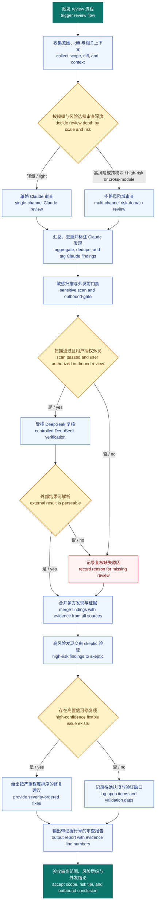

# hank-dev:review

<!-- HANK_REVIEW_SECURITY_CONTRACT_V3 -->

审查对象默认是当前分支相对 main 的 diff。用户也可以指定 PR 或 commit range。

DeepSeek 复核是外部模型调用。只有用户明确授权本次外发，且待审 patch 通过敏感信息扫描时才执行。缺少授权、扫描阻断、调用失败、超时、输出为空或解析失败时，最终报告必须写明“DeepSeek 复核缺失”和具体原因。

## 审查流程总览 / Review flow overview


```mermaid
flowchart TD
  accTitle: 多代理代码审查与外发门禁流程 | multi-agent review and outbound gating flow
  accDescr: 从审查范围收集到敏感扫描、独立复核与验收报告的流程 | from scope collection through sensitive scanning, independent verification, and review report

  A[触发 review 流程\ntrigger review flow] --> B[收集范围、diff 与相关上下文\ncollect scope, diff, and context]
  B --> C{按规模与风险选择审查深度\ndecide review depth by scale and risk}
  C --> |轻量 / light| D[单路 Claude 审查\nsingle-channel Claude review]
  C --> |高风险或跨模块 / high-risk or cross-module| E[多路风险域审查\nmulti-channel risk-domain review]
  D --> F[汇总、去重并标注 Claude 发现\naggregate, dedupe, and tag Claude findings]
  E --> F
  F --> G[敏感扫描与外发前门禁\nsensitive scan and outbound-gate]
  G --> H{扫描通过且用户授权外发\nscan passed and user authorized outbound review}
  H --> |是 / yes| I[受控 DeepSeek 复核\ncontrolled DeepSeek verification]
  H --> |否 / no| J[记录复核缺失原因\nrecord reason for missing review]
  I --> K{外部结果可解析\nexternal result is parseable}
  K --> |是 / yes| L[合并多方发现与证据\nmerge findings with evidence from all sources]
  K --> |否 / no| J
  J --> L
  L --> M[高风险发现交由 skeptic 验证\nhigh-risk findings to skeptic]
  M --> N{存在高置信可修复项\nhigh-confidence fixable issue exists}
  N --> |是 / yes| O[给出按严重程度排序的修复建议\nprovide severity-ordered fixes]
  N --> |否 / no| P[记录待确认项与验证缺口\nlog open items and validation gaps]
  O --> Q[输出带证据行号的审查报告\noutput report with evidence line numbers]
  P --> Q
  Q --> R[验收审查范围、风险层级与外发结论\naccept scope, risk tier, and outbound conclusion]

  classDef startEnd fill:#0f766e,color:#ffffff,stroke:#115e59,stroke-width:1.5px
  classDef gate fill:#fef3c7,color:#713f12,stroke:#d97706,stroke-width:1.5px
  classDef work fill:#eff6ff,color:#1e3a8a,stroke:#2563eb
  classDef risk fill:#fef2f2,color:#991b1b,stroke:#dc2626,stroke-width:1.5px
  class A,R startEnd
  class C,H,K,N gate
  class B,D,E,F,G,I,L,M,O,P,Q work
  class J risk
```

图说明：本图说明 review 从任务触发到高低风险问题汇总并产出结论的执行路径。This diagram maps review execution from trigger to consolidated findings and a final conclusion report.

## Step 1：规模与风险判定

先读取需求和测试，再采集文件数、改动行数、跨模块情况以及鉴权、密钥、支付、外部输入、数据库、并发、重试、部署等风险面。

轻量模式适用于不超过 3 个文件、不超过 250 行、集中在同一模块且未命中高风险面的改动。其他情况进入团队模式。用户可以用 `quick` 或 `team` 强制规模，但 `quick` 不能绕过安全检查。

## Step 2：Claude 审查

轻量模式拉起一个 Claude reviewer，覆盖正确性、简化复用和测试充分性。命中高风险面时增加定向攻击检查。

团队模式按真实风险拆分正确性、安全、测试、并发、事务、API 契约等维度。DeepSeek 不作为原生 team 成员，由当前执行 Agent 发起下述受限调用并整合结果。

## Step 3：DeepSeek 单文件复核

### 3.1 外发前门禁

1. 验证用户已明确授权本次 diff 外发。
2. 将待审文本 diff 写入本地 patch 文件。
3. 根据当前 `SKILL.md` 的绝对路径解析插件根目录。
4. 运行插件根目录中的 `scripts/run-deepseek-review.py`，由它创建空临时目录并复制为唯一输入文件 `review-input.patch`。
5. runner 在外发前运行同目录的 `check-review-patch.sh`。
6. patch 超过 2 MiB、包含 binary diff、私钥、认证头、Cookie、云厂商凭据、常见服务 token、凭据连接串或其他高置信度凭据形态时失败关闭。
7. 扫描输出只包含规则编号、文件、行号和计数，不得输出命中内容、截断值或哈希。
8. 任一规则命中时不得调用外部模型，报告“DeepSeek 复核缺失，敏感信息门禁阻止外发”。

### 3.2 dsh 权限

```bash
review_patch_file="<本次待审 patch 的绝对路径>"
plugin_root="<根据当前 SKILL.md 绝对路径解析的插件根目录>"
HANK_DEEPSEEK_OUTBOUND_APPROVED=1 \
  "$plugin_root/scripts/run-deepseek-review.py" "$review_patch_file"
```

环境变量只表示用户已经明确授权本次外发，不能跨轮次复用。runner 从输入复制开始执行 120 秒整体超时，并捕获标准输出、标准错误和退出码。禁止添加任何自动审批参数。runner 以 `DSH_PERMISSION_MODE=read-only` 调用 `dsh --profile headless`：该模式下写入与执行会被沙箱拒绝且无审批通道可逃逸（已用真实调用验证：命令仍成功退出并给出报告，但目标文件确认未被创建）。读取权限是按整个工作目录授予的，不是单文件白名单——工作目录（临时隔离目录）里只放了 `review-input.patch` 和两个全新的隔离 `home`/`DSH_HOME` 子目录，模型能读到的本地内容仅限于此；相比旧版 OpenCode 的单文件读取白名单，这是更粗粒度的边界，是已知并接受的取舍，不是遗漏。runner 使用隔离的 HOME 与全新的 `DSH_HOME`，只显式传入 `DEEPSEEK_API_KEY`，不继承其余环境变量。

runner 清理临时目录前验证它由本次调用创建，且直接位于 `${TMPDIR:-/tmp}` 下。

### 3.3 结果判定

runner 直接解析 `dsh --profile headless` 的纯文本输出（不是 JSONL 事件流）。以下任一情况都判为 DeepSeek 复核失败：

1. 非零退出码或超时。
2. 标准错误非空（成功的 dsh 调用应该没有任何 stderr 输出；出现任何内容都按不确定状态失败关闭，不去猜测其含义）。
3. 输出为空。
4. 文本只表示拒绝执行，没有实际 finding。

runner 启动前用 `shutil.which("dsh")` 解析出绝对路径，并校验该文件属主是当前用户且不允许 group/other 写入才使用；两者任一不满足都失败关闭（`dsh_untrusted_binary`）。这只挡得住"PATH 里更早的目录被放了一个 group/other 可写或非本用户拥有的同名文件"这类经典 PATH 投毒，防不住调用账户本身已经被攻破的情形，也不做二进制签名或哈希校验。已知取舍（TOCTOU）：`stat` 校验和实际执行之间存在竞态窗口，未做基于文件描述符的免竞态执行；当前判断该场景风险可接受，暂不修复，后续如有需要再处理。

## Step 4：整合与对抗验证

合并 Claude 与 DeepSeek 结果。同一文件同一行的同类问题只保留一条，并标注双方一致。保留双方独有发现并注明来源。

高风险改动需要主动构造攻击路径。Critical 和 High finding 再交给 skeptic 尝试推翻，证据不足的内容降为未证实假设。

## 输出格式

报告包含编排摘要、按严重程度排序的 findings、未证实假设和验证缺口。每条 finding 使用绝对路径、行号、触发场景、严重程度、置信度、证据和来源。支持 `--fix`，但只修复高置信度且边界明确的问题。
