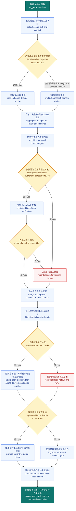

# hank-dev:review

<!-- HANK_REVIEW_SECURITY_CONTRACT_V3 -->

审查对象默认是当前分支相对 main 的 diff。用户也可以指定 PR 或 commit range。

DeepSeek 复核是外部模型调用。只有用户明确授权本次外发，且待审 patch 通过敏感信息扫描时才执行。缺少授权、扫描阻断、调用失败、超时、输出为空或解析失败时，最终报告必须写明“DeepSeek 复核缺失”和具体原因。

## 审查流程总览 / Review flow overview


```mermaid
flowchart TD
  accTitle: 多代理代码审查与外发门禁流程 | multi-agent review and outbound gating flow
  accDescr: 从审查范围收集到敏感扫描、独立复核与验收报告的流程 | from scope collection through sensitive scanning, independent verification, and review report

  A[触发 review 流程\ntrigger review flow] --> B[收集范围、diff 与相关上下文\ncollect scope, diff, and context]
  B --> C{按规模与风险选择审查深度\ndecide review depth by scale and risk}
  C --> |轻量 / light| D[单路 Claude 审查\nsingle-channel Claude review]
  C --> |高风险或跨模块 / high-risk or cross-module| E[多路风险域审查\nmulti-channel risk-domain review]
  D --> F[汇总、去重并标注 Claude 发现\naggregate, dedupe, and tag Claude findings]
  E --> F
  F --> G[敏感扫描与外发前门禁\nsensitive scan and outbound-gate]
  G --> H{扫描通过且用户授权外发\nscan passed and user authorized outbound review}
  H --> |是 / yes| I[受控 DeepSeek 复核\ncontrolled DeepSeek verification]
  H --> |否 / no| J[记录复核缺失原因\nrecord reason for missing review]
  I --> K{外部结果可解析\nexternal result is parseable}
  K --> |是 / yes| L[合并多方发现与证据\nmerge findings with evidence from all sources]
  K --> |否 / no| J
  J --> L
  L --> M[高风险发现交由 skeptic 验证\nhigh-risk findings to skeptic]
  M --> S{仓库有可执行检查\nrepo has runnable checks}
  S --> |是 / yes| T[逐元素消融，再对删除候选做组合消融\nablate each element, then ablate deletion candidates together]
  S --> |否 / no| U[记录消融未运行及原因\nrecord ablation not run and why]
  T --> N{存在高置信可修复项\nhigh-confidence fixable issue exists}
  U --> N
  N --> |是 / yes| O[给出按严重程度排序的修复建议\nprovide severity-ordered fixes]
  N --> |否 / no| P[记录待确认项与验证缺口\nlog open items and validation gaps]
  O --> Q[输出带证据行号的审查报告\noutput report with evidence line numbers]
  P --> Q
  Q --> R[验收审查范围、风险层级与外发结论\naccept scope, risk tier, and outbound conclusion]

  classDef startEnd fill:#0f766e,color:#ffffff,stroke:#115e59,stroke-width:1.5px
  classDef gate fill:#fef3c7,color:#713f12,stroke:#d97706,stroke-width:1.5px
  classDef work fill:#eff6ff,color:#1e3a8a,stroke:#2563eb
  classDef risk fill:#fef2f2,color:#991b1b,stroke:#dc2626,stroke-width:1.5px
  class A,R startEnd
  class C,H,K,N,S gate
  class B,D,E,F,G,I,L,M,O,P,Q,T work
  class J,U risk
```

图说明：本图说明 review 从任务触发到高低风险问题汇总并产出结论的执行路径。This diagram maps review execution from trigger to consolidated findings and a final conclusion report.

## Step 1：规模与风险判定

先读取需求和测试，再采集文件数、改动行数、跨模块情况以及鉴权、密钥、支付、外部输入、数据库、并发、重试、部署等风险面。

轻量模式适用于不超过 3 个文件、不超过 250 行、集中在同一模块且未命中高风险面的改动。其他情况进入团队模式。用户可以用 `quick` 或 `team` 强制规模，但 `quick` 不能绕过安全检查。

## Step 2：Claude 审查

轻量模式拉起一个 Claude reviewer，覆盖正确性、简化复用和测试充分性。命中高风险面时增加定向攻击检查。

团队模式按真实风险拆分正确性、安全、测试、并发、事务、API 契约等维度。DeepSeek 不作为原生 team 成员，由当前执行 Agent 发起下述受限调用并整合结果。

## Step 3：DeepSeek 单文件复核

### 3.1 外发前门禁

1. 验证用户已明确授权本次 diff 外发。
2. 将待审文本 diff 写入本地 patch 文件。
3. 根据当前 `SKILL.md` 的绝对路径解析插件根目录。
4. 运行插件根目录中的 `scripts/run-deepseek-review.py`，由它创建空临时目录并复制为唯一输入文件 `review-input.patch`。
5. runner 在外发前运行同目录的 `check-review-patch.sh`。
6. patch 超过 2 MiB、包含 binary diff、私钥、认证头、Cookie、云厂商凭据、常见服务 token、凭据连接串或其他高置信度凭据形态时失败关闭。
7. 扫描输出只包含规则编号、文件、行号和计数，不得输出命中内容、截断值或哈希。
8. 任一规则命中时不得调用外部模型，报告“DeepSeek 复核缺失，敏感信息门禁阻止外发”。

### 3.2 dsh 权限

```bash
review_patch_file="<本次待审 patch 的绝对路径>"
plugin_root="<根据当前 SKILL.md 绝对路径解析的插件根目录>"
HANK_DEEPSEEK_OUTBOUND_APPROVED=1 \
  "$plugin_root/scripts/run-deepseek-review.py" "$review_patch_file"
```

环境变量只表示用户已经明确授权本次外发，不能跨轮次复用。runner 从输入复制开始执行 120 秒整体超时，并捕获标准输出、标准错误和退出码。禁止添加任何自动审批参数。runner 以 `DSH_PERMISSION_MODE=read-only` 调用 `dsh --profile headless`：该模式下写入与执行会被沙箱拒绝且无审批通道可逃逸（已用真实调用验证：命令仍成功退出并给出报告，但目标文件确认未被创建）。读取权限是按整个工作目录授予的，不是单文件白名单——工作目录（临时隔离目录）里只放了 `review-input.patch` 和两个全新的隔离 `home`/`DSH_HOME` 子目录，模型能读到的本地内容仅限于此；相比旧版 OpenCode 的单文件读取白名单，这是更粗粒度的边界，是已知并接受的取舍，不是遗漏。runner 使用隔离的 HOME 与全新的 `DSH_HOME`，只显式传入 `DEEPSEEK_API_KEY`，不继承其余环境变量。

runner 清理临时目录前验证它由本次调用创建，且直接位于 `${TMPDIR:-/tmp}` 下。

### 3.3 结果判定

runner 直接解析 `dsh --profile headless` 的纯文本输出（不是 JSONL 事件流）。以下任一情况都判为 DeepSeek 复核失败：

1. 非零退出码或超时。
2. 标准错误非空（成功的 dsh 调用应该没有任何 stderr 输出；出现任何内容都按不确定状态失败关闭，不去猜测其含义）。
3. 输出为空。
4. 文本只表示拒绝执行，没有实际 finding。

runner 启动前用 `shutil.which("dsh")` 解析出绝对路径，并校验该文件属主是当前用户且不允许 group/other 写入才使用；两者任一不满足都失败关闭（`dsh_untrusted_binary`）。这只挡得住"PATH 里更早的目录被放了一个 group/other 可写或非本用户拥有的同名文件"这类经典 PATH 投毒，防不住调用账户本身已经被攻破的情形，也不做二进制签名或哈希校验。已知取舍（TOCTOU）：`stat` 校验和实际执行之间存在竞态窗口，未做基于文件描述符的免竞态执行；当前判断该场景风险可接受，暂不修复，后续如有需要再处理。

## Step 4：整合与对抗验证

合并 Claude 与 DeepSeek 结果。同一文件同一行的同类问题只保留一条，并标注双方一致。保留双方独有发现并注明来源。

高风险改动需要主动构造攻击路径。Critical 和 High finding 再交给 skeptic 尝试推翻，证据不足的内容降为未证实假设。

## Step 5：消融实验

前置条件是仓库里有能一条命令跑完、结果可机器读的检查：单测、e2e、冒烟脚本都行。没有就不跑，报告里写“消融实验未运行，仓库无可执行检查”，不要用推理冒充实验结果。

做法是把本次改动拆成一个个可独立移除的元素，每次只移除一个，重跑全部检查，记录相对基线**新增**的失败，然后还原再做下一个。

- 先在未改动状态跑一次基线并记下已经失败的检查。不减基线的话，一个既有的失败会把每个元素都染成承重。
- **只有全绿的基线才允许得出「删除」结论。** 基线里已经红的检查给不出信号：它覆盖的代码被拆掉之后它仍然只是原来那个红，新增失败数是零，于是那个元素会被误判成可删。基线有红时，把那些检查标记为不可用作证据，只被它们覆盖的元素一律记「未验证」，不许自动删。
- 逐条还原，避免两个移除叠在一起。
- 元素的粒度是“一个决定”，不是“一行”：一个 class、一个属性、一个守卫、一个新文件、一个参数默认值、一次调用顺序的调整。
- 热更新覆盖不到的改动（配置、路由选项、构建期产物）单独标记，移除后重启服务再跑，否则测到的是旧代码。

### 先决条件：这一步会执行待审代码

消融要反复运行仓库自己的检查，而检查命令、`package.json` scripts、测试配置本身都在待审 diff 的管辖范围内。**跑检查等于执行这份 diff 里的代码。** 临时 worktree 只保护原工作区，挡不住网络、凭据和主机上的其它文件。

所以先判断 diff 可不可信：自己的分支、同事在本仓库的分支，属于日常可信，直接跑。来源不明的仓库、外部贡献者的 PR、对方丢来的补丁，一律不在本机跑这一步，要么整步跳过并在报告里写明原因，要么放进容器或 VM。判断标准和排雷清单沿用 `untrusted_repo_tripwire`。

### 在哪里跑：不带 `--fix` 的 review 必须是只读的

消融要改文件，所以**不在用户的工作区跑**。为这一步开一个临时 git worktree（或等价的可整体回滚的副本），检查、服务、端口都指向它，结束后删掉并确认原工作区一个字节都没动。

这不是理论风险：首次实跑时进程被中途杀掉，工作区就停在某个元素被拆掉的状态，靠人肉发现才修回来。逐条还原只在正常路径上成立，异常退出不会替你还原。

**把待审改动搬进副本，不要以为它自己会跟过去。** `git worktree add` 只检出提交对象，staged、unstaged 和 untracked 一个都不带，于是最常见的「审查未提交改动」场景会变成在基线提交上做消融，结论与被审对象无关。做法是 `git diff --binary HEAD` 导出一份补丁应用到副本（`--binary` 不能省，否则改过的图片、字体这类已跟踪二进制只会产出 `Binary files differ`，补丁应用不上），再单独复制需要的 untracked 文件，最后比对副本与审查输入一致才开始。它已经同时含 staged 与 unstaged，别再叠一份 `git diff --cached`，那会把 staged 的 hunk 应用两次并冲突。

副本还要能真的跑起来：依赖、gitignored 的环境文件、端口都得各自备一份，否则检查会因为环境缺失而全红，而在增量口径下全红的基线会让几乎每个元素都显示零新增失败，也就是把所有东西都染成可删，比测不出来更糟。

- **不带 `--fix`**：三种判读只写进报告。不删任何代码，不新增任何检查文件，不留下任何工作区改动。报告里把“建议删除”和“建议补的检查”写清楚，包括补的检查长什么样、能咬住哪一条。
- **带 `--fix`**：把已确认的删除和补上的检查应用到目标工作区，同样只应用高置信度且边界明确的那些，其余仍然只进报告。

### 判读：拆掉之后什么都没坏，有三种解释

必须逐条选一个写进报告，不能含糊过去。

1. **这个元素确实不承重** → 删掉它。
2. **检查漏了它存在的场景** → 补检查，然后重跑这一条，确认新检查能咬住。
3. **它和别的元素互为冗余，而这份冗余是有意的** → 保留，写明和谁冗余、为什么两份都要。纵深防御的多道授权校验、降级路径、重复的容错都是这一类。

第三种是单元素消融的固有盲区，必须专门防：两道守卫各自拆掉都全绿，于是各自被判成可删，一起删就出洞。首次实跑里就有一例，外层容器的 `overflow-hidden` 拆掉零失败，真实原因是里层还有一道同样的裁剪。所以：

- 凡是判成「删除」的元素，先查它是不是和另一个元素在做同一件事。是的话要能说出这份冗余的理由，安全、容错或降级；说得出才归第三类、两个都留。说不出就是偶然重复，留一个删一个，并用下面的组合消融验证删掉的那个确实无关。
- 把所有判成「删除」的元素凑成一组再拆一次，跑完整检查。这一步专抓单独拆看不见的组合失效。
- 接受一次删除之后重设基线再继续，否则后面每一条都是在一棵已经变过的树上测的。
- 全部删除落定后，对累计后的改动整跑一次检查。

第二种是这一步最主要的产出，也是它比通读代码强的地方。断言写得不够刁钻会假通过：例如“导航后回到顶部”这条，如果目标页很短，滚动偏移本来就会被浏览器夹回 0，于是有没有重置逻辑它都通过；把重置逻辑整个删掉、检查依然全绿，才暴露出这条断言测的是假的。改成“从一个长页面导航到另一个长页面”之后才有区分度。

写下结论时区分“已验证承重”和“保留但检查覆盖不到”。后者不算已验证，要写清楚为什么仍然保留（例如它在改动前就存在、这次只是平移）。

### 什么不进删除式消融

**测试、检查脚本、测试配置。** 删掉本次新增的一个测试，剩下的检查照样全绿，因为测试的价值是拦住以后的回归，不是让当下正确的实现失败。按删除式判读它必然被打成「不承重」，`--fix` 就会把它删掉，这是这套方法最危险的一个误判。测试要反着测：改坏它覆盖的那段生产代码，看这个新测试会不会失败。不会失败的才是真的不承重。

**注释。** 移除任何注释都不会让检查失败，所以消融对注释永远给不出信号。对注释问另一个问题：**没有这句话，读代码的人会误判什么。** 答不上来就删。同一轮里顺带量一下基线（`git ls-tree` 遍历同类文件，统计注释块行数分位数与注释占非空行比例），把本次新增的注释比例和基线摆在一起，超出一个量级就是要砍。

### 输出

一张表：元素、移除后新增失败的检查数、结论（保留／删除／补检查）。补了检查的要附上新检查的名字和它现在能咬住哪一条。

## 输出格式

报告包含编排摘要、按严重程度排序的 findings、消融实验表、未证实假设和验证缺口。每条 finding 使用绝对路径、行号、触发场景、严重程度、置信度、证据和来源。支持 `--fix`，但只修复高置信度且边界明确的问题。
